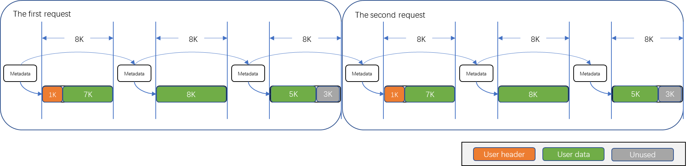
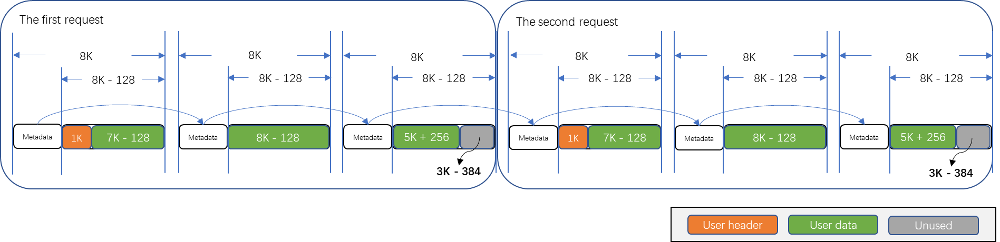

# UMQ Buffer

## Overview

The UMQ Buffer serves as a data-plane memory pool provided by the UMQ component. Leveraging features such as singly linked lists and TLS (Thread-Local Storage), it delivers high-performance memory pool management capabilities for end-to-end data transmission.

When using UMQ Buffer, two primary memory entities are involved:

* Message metadata (`umq_buf_t` or `struct umq_buf`): Records configuration details for the associated message payload.
* Message payload: The actual memory region storing user data.

## Message Metadata

The definition of message metadata can be referenced in [umq_types.h](https://gitee.com/openeuler/umdk/blob/master/src/urpc/include/umq/umq_types.h). Key fields include:

* `qbuf_next`: Address of the next buffer’s metadata in the chain, enabling batch operations via linked lists.
* `umqh`: Indicates whether the memory belongs to a specific UMQ instance (e.g., in shared memory scenarios).
* `total_data_size`: Total payload length across fragmented buffers. For example, three chained 8KB buffers yield total_data_size equals to 24KB.
* `buf_size`: Combined size of metadata + payload.
* `data_size`: Length of valid data within the payload.
* `headroom_size`: Length of user header within the payload.
* `first_fragment`: Flags whether this is the initial fragment in a multi-buffer request. Holds request-level configuration.
* `token_id`: Internal UMQ token id for tracking.
* `mempool_id`: Identifies the memory pool owning this buffer.
* `token_value`: Internal UMQ token value for tracking.
* `status`: Error code returned to users upon data-plane failures.
* `io_direction`: Specifies I/O direction (e.g., TX for transmit, RX for receive).
* `need_import`: Internal flag for memory registration during expansion (transparent to users).
* `buf_data`: Pointer to the actual payload.
* `qbuf_ext`: Extended configuration (`umq_buf_pro_t`/`struct umq_buf_pro`) for data-plane operations. Defined in [umq_pro_types.h](https://gitee.com/openeuler/umdk/blob/master/src/urpc/include/umq/umq_pro_types.h).
* `data`: Start address of the payload in combine mode (metadata and payload are contiguous).

## Message Payload
The payload stores user data, which may span multiple buffers. Logically, each payload consists of three segments:

* User header (headroom): Custom metadata prefix.
* User data (data): Actual application data.
* Unused memory: Remaining unused space.

For any single buffer:
* headroom_size = Length of the user header.
* data_size = Length of valid user data.

Constraint: The user header always precedes user data in memory.

## Modes

UMQ Buffer supports two modes:

* Split Mode (UMQ_BUF_SPLIT)
* Combine Mode (UMQ_BUF_COMBINE)

### Split Mode

Metadata and payload reside in non-contiguous memory regions.

Access payload via buf_data (direct data access is invalid).
Payload size is aligned to 4KB huge-page boundaries.
Ideal for scenarios requiring exact huge-page-sized allocations.
Split Mode Layout

### Combine Mode

Metadata and payload are contiguous in memory.

Payload accessible via data or buf_data.
Total buffer size (metadata + payload) aligns to 4KB huge pages.
Payload size is slightly smaller than split mode due to metadata overhead.
Optimized for latency-sensitive use cases.

## API Reference
UMQ Buffer APIs are defined in [umq_api.h](https://gitee.com/openeuler/umdk/blob/master/src/urpc/include/umq/umq_api.h). Batch operations are supported for high-performance allocation/free cycles.

### Memory Allocation

umq_buf_alloc parameters:

* `request_size`: Total data size per request.
* `request_qbuf_num`: Number of requests to allocate.
* `umqh`: UMQ handle (for non-global pools).
* `option`: Extended configuration (e.g., headroom_size).

#### Split Mode Example
> **Note**
> * Only the first fragment of a request stores valid total_data_size and qbuf_ext.
> * Examples use typical buffer size (8KB).

First request, first fragment:

* `total_data_size`: 20KB (entire request size).
* `buf_size`: 128B (metadata) + 8KB.
* `data_size`: 7KB (excludes user header).
* `headroom_size`: 1KB.

First request, second fragment:

* `buf_size`: 128B + 8KB.
* `data_size`: 8KB.

First request, third fragment:

* `buf_size`: 128B + 8KB.
* `data_size`: 5KB.

(Second request follows identical structure.)

#### Combine Mode Example
> **Note**
> * Only the first fragment stores valid request-level metadata.
> * Examples use typical buffer size (8KB).

First request, first fragment:

* `total_data_size`: 20KB.
* `buf_size`: 8KB (metadata + payload).
* `data_size`: 7KB − 128B (excludes user header + metadata overhead).
* `headroom_size`: 1KB.

First request, second fragment:

* `buf_size`: 8KB.
* `data_size`: 8KB − 128B.

First request, third fragment:

* `buf_size`: 8KB.
* `data_size`: 5KB + 256B (adjusted for metadata alignment).

(Second request follows identical structure.)