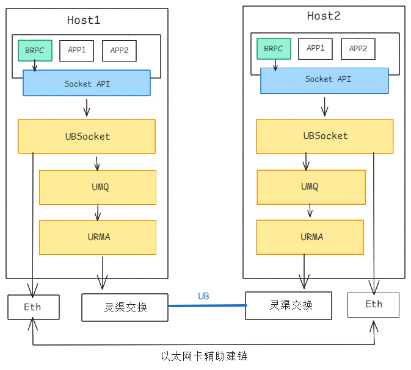

## 概述

UBSocket是用户态无感加速库，在用户态截获标准POSIX socket接口，南向对接urma通过UB高性能网络协议进行加速。UBSocket技术架构图如下：

**UBSocket关键流程**
- 应用创建Socket链接；
- 应用调用原生Socket接口；
- UBSocket通过以太网平面交换双方EID/Jetty信息并创建UB通信通道；
- 在发包流程UBSocket将Socket转换为UBMA接口，走UB转发通道；
- 支持UB和Eth自切换，实现逃生；

## UBSocket的主要特性

**基础构建**
- 支持cmake和bazel两种构建方式
- 支持容器化部署

**通信功能**
- 北向兼容Socket API
- 支持Socket粒度开启或关闭UB加速
- 支持进程粒度设置开启或关闭UB加速
- 支持进程粒度设置Socket通信负载策略

**可靠可用性**
- 支持UB链路级主备切换
- 支持UB链路到TCP链路的逃生切换

**可维可测工具类**
- 支持维测CLI工具
- 支持维测数据统计（连接数/收发包数/重传丢包等）
- 支持bRPC Connection服务
- 支持urma Ping工具，用于探测UB两个端点EID的连通性
- 支持urma Perftest工具，用于测试UB通道性能
