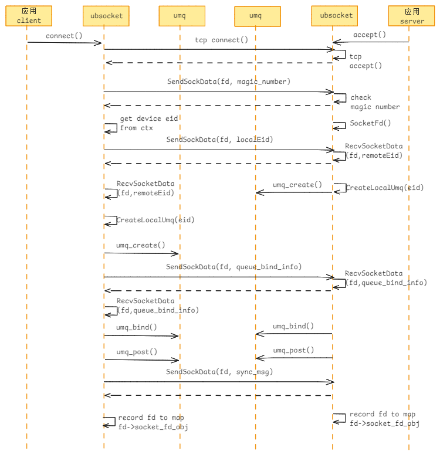
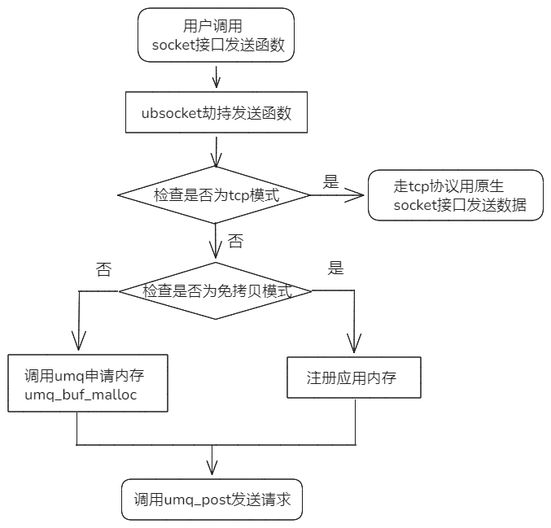
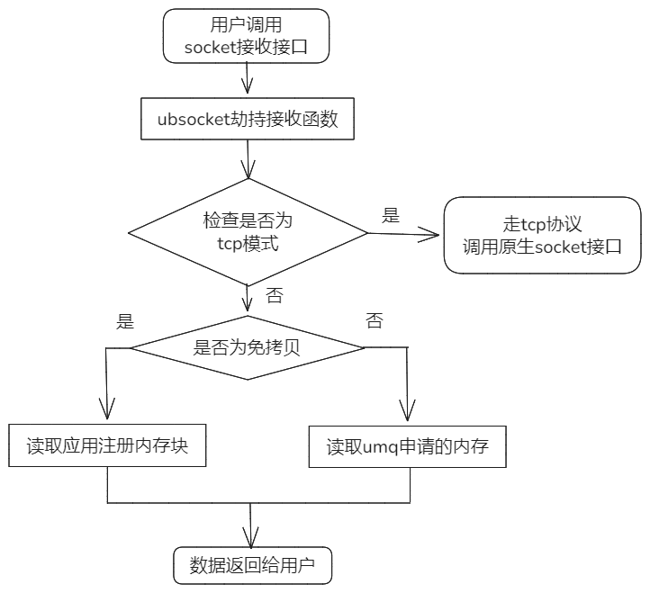

# UBSocket IO

## UBSocket主流程介绍
UBSocket北向兼容标准POSIX socket API及错误码，南向对接urma通过UB高性能网络协议进行加速。
本章从建链流程和收发流程来介绍每个接口拦截的实现流程。

**建链流程**
- ubsocket拦截socket的connect()和accept()接口实现UB链路建链，主要实现流程如下：



**收发流程**
- ubsocket拦截send()/write()/writev()等接口进行数据发送，主要实现流程如下：



- ubsocket拦截recv()/read()/readv()等接口进行数据接受，主要实现流程如下：



## UBSocket对Socket接口支持的方式

**Socket粒度开启UB加速**
- 通过用户在业务代码中使用Linux系统提供的socket()函数创建socket套接字的时候，选择不同的domain来支持是否使用UB加速，通过建立时的magic number
来判断两边是否为同一种协议。
- 客户端socket()函数的domain参数填写AF_SMC时则使用UB加速， 如果Server不支持UB能力则返回建连失败；
    ```C++
    socket(AF_SMC, SOCK_STREAM, 0)
    ```
- 客户端socket()函数的domain参数填写或者缺省（AF_INET），则不适用UB加速，建立普通TCP连接。
    ```C++
    socket(AF_INET, SOCK_STREAM, 0)
    ```

**进程粒度开启UB加速**
- 用户通过LD_PRELOAD方式，劫持业务进程调用的Socket原生接口。