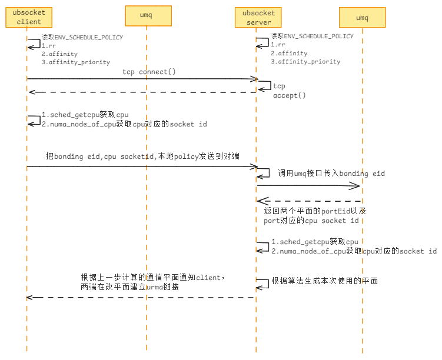

# UBSocket Load Strategy

## UBSocket进程粒度设置Socket通信负载策略
UBSocket按照Client支持配合负载策略：



**配置RR策略**

UBSocket在两版本平面上轮询调度
```c++
UBSOCKET_SCEDULE_POLICY = rr
```

**配置亲和策略**：
- 在容器绑定numa的情况下，会基于容器所在Numa进行Socket建链；
- 在容器没有绑定numa的情况下，会基于业务线程所在Numa进行Socket建链；

```c++
UBSOCKET_SCEDULE_POLICY = affinity
```

**配置亲和优先策略**：
- UBSocket根据线程所在CPU将URMA链接建立在亲和平面上，失败重试选择其他平面尝试重新建链（默认策略）

```c++
UBSOCKET_SCEDULE_POLICY = affinity_priority
```

