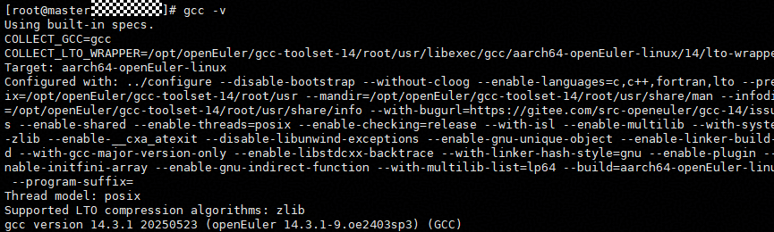
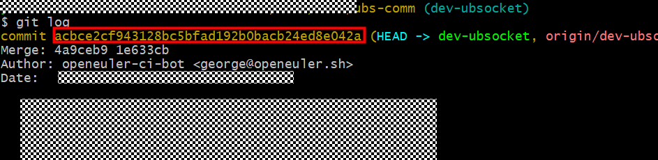
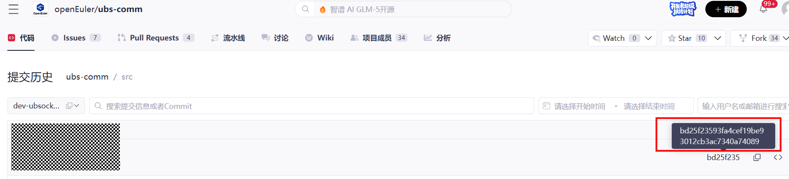
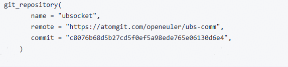

# UBSocket使用手册

## 前言<a id="前言"></a>

### 概述

本文档详细的描述了UBSocket软硬件配套说明、API和环境变量说明、构建说明、运行说明，同时提供了常见的问题解答及故障处理防范。

### 读者对象

本文档主要适用于对接UBSocket的开发人员，开发人员必须具备以下经验和技能：

-   熟悉网络通信的基本知识，对socket编程和UB协议有一定知识积累。
-   有基础的编程能力，了解C++基本语法。

### 符号约定

在本文中可能出现下列标志，它们所代表的含义如下。

<a name="table2622507016410"></a>
<table><thead align="left"><tr id="row1530720816410"><th class="cellrowborder" valign="top" width="20.580000000000002%" id="mcps1.1.3.1.1"><p id="p6450074116410"><a name="p6450074116410"></a><a name="p6450074116410"></a><strong id="b2136615816410"><a name="b2136615816410"></a><a name="b2136615816410"></a>符号</strong></p>
</th>
<th class="cellrowborder" valign="top" width="79.42%" id="mcps1.1.3.1.2"><p id="p5435366816410"><a name="p5435366816410"></a><a name="p5435366816410"></a><strong id="b5941558116410"><a name="b5941558116410"></a><a name="b5941558116410"></a>说明</strong></p>
</th>
</tr>
</thead>
<tbody><tr id="row1372280416410"><td class="cellrowborder" valign="top" width="20.580000000000002%" headers="mcps1.1.3.1.1 "><p id="p3734547016410"><a name="p3734547016410"></a><a name="p3734547016410"></a><a name="image2670064316410"></a><a name="image2670064316410"></a><span></span></p>
</td>
<td class="cellrowborder" valign="top" width="79.42%" headers="mcps1.1.3.1.2 "><p id="p1757432116410"><a name="p1757432116410"></a><a name="p1757432116410"></a>表示如不避免则将会导致死亡或严重伤害的具有高等级风险的危害。</p>
</td>
</tr>
<tr id="row466863216410"><td class="cellrowborder" valign="top" width="20.580000000000002%" headers="mcps1.1.3.1.1 "><p id="p1432579516410"><a name="p1432579516410"></a><a name="p1432579516410"></a><a name="image4895582316410"></a><a name="image4895582316410"></a><span></span></p>
</td>
<td class="cellrowborder" valign="top" width="79.42%" headers="mcps1.1.3.1.2 "><p id="p959197916410"><a name="p959197916410"></a><a name="p959197916410"></a>表示如不避免则可能导致死亡或严重伤害的具有中等级风险的危害。</p>
</td>
</tr>
<tr id="row123863216410"><td class="cellrowborder" valign="top" width="20.580000000000002%" headers="mcps1.1.3.1.1 "><p id="p1232579516410"><a name="p1232579516410"></a><a name="p1232579516410"></a><a name="image1235582316410"></a><a name="image1235582316410"></a><span></span></p>
</td>
<td class="cellrowborder" valign="top" width="79.42%" headers="mcps1.1.3.1.2 "><p id="p123197916410"><a name="p123197916410"></a><a name="p123197916410"></a>表示如不避免则可能导致轻微或中度伤害的具有低等级风险的危害。</p>
</td>
</tr>
<tr id="row5786682116410"><td class="cellrowborder" valign="top" width="20.580000000000002%" headers="mcps1.1.3.1.1 "><p id="p2204984716410"><a name="p2204984716410"></a><a name="p2204984716410"></a><a name="image4504446716410"></a><a name="image4504446716410"></a><span></span></p>
</td>
<td class="cellrowborder" valign="top" width="79.42%" headers="mcps1.1.3.1.2 "><p id="p4388861916410"><a name="p4388861916410"></a><a name="p4388861916410"></a>用于传递设备或环境安全警示信息。如不避免则可能会导致设备损坏、数据丢失、设备性能降低或其它不可预知的结果。</p>
<p id="p1238861916410"><a name="p1238861916410"></a><a name="p1238861916410"></a>“须知”不涉及人身伤害。</p>
</td>
</tr>
<tr id="row2856923116410"><td class="cellrowborder" valign="top" width="20.580000000000002%" headers="mcps1.1.3.1.1 "><p id="p5555360116410"><a name="p5555360116410"></a><a name="p5555360116410"></a><a name="image799324016410"></a><a name="image799324016410"></a><span></span></p>
</td>
<td class="cellrowborder" valign="top" width="79.42%" headers="mcps1.1.3.1.2 "><p id="p4612588116410"><a name="p4612588116410"></a><a name="p4612588116410"></a>对正文中重点信息的补充说明。</p>
<p id="p1232588116410"><a name="p1232588116410"></a><a name="p1232588116410"></a>“说明”不是安全警示信息，不涉及人身、设备及环境伤害信息。</p>
</td>
</tr>
</tbody>
</table>

### 修改记录

<a name="table1557726816410"></a>
<table><thead align="left"><tr id="row2942532716410"><th class="cellrowborder" valign="top" width="20.72%" id="mcps1.1.4.1.1"><p id="p3778275416410"><a name="p3778275416410"></a><a name="p3778275416410"></a><strong id="b5687322716410"><a name="b5687322716410"></a><a name="b5687322716410"></a>文档版本</strong></p>
</th>
<th class="cellrowborder" valign="top" width="26.119999999999997%" id="mcps1.1.4.1.2"><p id="p5627845516410"><a name="p5627845516410"></a><a name="p5627845516410"></a><strong id="b5800814916410"><a name="b5800814916410"></a><a name="b5800814916410"></a>发布日期</strong></p>
</th>
<th class="cellrowborder" valign="top" width="53.16%" id="mcps1.1.4.1.3"><p id="p2382284816410"><a name="p2382284816410"></a><a name="p2382284816410"></a><strong id="b3316380216410"><a name="b3316380216410"></a><a name="b3316380216410"></a>修改说明</strong></p>
</th>
</tr>
</thead>
<tbody><tr id="row5947359616410"><td class="cellrowborder" valign="top" width="20.72%" headers="mcps1.1.4.1.1 "><p id="p2149706016410"><a name="p2149706016410"></a><a name="p2149706016410"></a>01</p>
</td>
<td class="cellrowborder" valign="top" width="26.119999999999997%" headers="mcps1.1.4.1.2 "><p id="p648803616410"><a name="p648803616410"></a><a name="p648803616410"></a>2026-02-12</p>
</td>
<td class="cellrowborder" valign="top" width="53.16%" headers="mcps1.1.4.1.3 "><p id="p1946537916410"><a name="p1946537916410"></a><a name="p1946537916410"></a>第一次正式发布。</p>
</td>
</tr>
</tbody>
</table>

## 目录

-   [前言](#前言)
-   [UBSocket概述](#UBSocket概述)
    -   [简介](#简介)
    -   [工作原理](#工作原理)
    -   [代码模型](#代码模型)

-   [配套说明](#配套说明)
    -   [软件版本配套说明](#软件版本配套说明)
    -   [硬件版本配套说明](#硬件版本配套说明)

-   [环境变量和API说明](#环境变量和API说明)
    -   [环境变量和gflags说明](#环境变量和gflags说明)
    -   [API说明](#API说明)

-   [构建说明](#构建说明)
    -   [软件获取](#软件获取)
        -   [bazel构建](#bazel构建)
        -   [cmake构建](#cmake构建)

    -   [版本号检查](#版本号检查)
    -   [编程指导](#编程指导)
    -   [编译指导](#编译指导)
        -   [bazel构建](#bazel构建-0)
        -   [cmake构建](#cmake构建-1)

-   [运行说明](#运行说明)
    -   [bazel构建执行](#bazel构建执行)
    -   [cmake构建执行](#cmake构建执行)
    -   [日志目录](#日志目录)
    -   [日志格式](#日志格式)

-   [运维指标采集](#运维指标采集)
-   [问题排查指导](#问题排查指导)
    -   [错误码含义和处理建议](#错误码含义和处理建议)
    -   [常见问题排查指导](#常见问题排查指导)

## 1 UBSocket概述<a id="UBSocket概述"></a>

### 1.1 简介<a id="简介"></a>

UBSocket通信加速库，支持拦截TCP应用中的POSIX Socket API，将TCP通信转换为UB高性能通信，从而实现通信加速。使用UBSocket，传统TCP应用或TCP通信库可以少修改甚至不修改源码，快速使能UB通信。UBSocket的通信加速能力已经在[bRPC](https://brpc.apache.org/zh/docs/overview/)上验证，并获得性能提升，未来将继续拓展更多场景。

### 1.2 工作原理<a id="工作原理"></a>

UBSocket通信加速库，支持拦截TCP应用中的POSIX Socket API，将TCP通信转换为UB高性能通信，从而实现通信加速。

### 1.3 代码模型<a id="代码模型"></a>

**表 1-1**  代码说明

<a name="table153651632193214"></a>
<table><thead align="left"><tr id="row15365193253217"><th class="cellrowborder" valign="top" width="30%" id="mcps1.2.3.1.1"><p id="p11366203273218"><a name="p11366203273218"></a><a name="p11366203273218"></a>目录</p>
</th>
<th class="cellrowborder" valign="top" width="70%" id="mcps1.2.3.1.2"><p id="p5366132123212"><a name="p5366132123212"></a><a name="p5366132123212"></a>代码说明</p>
</th>
</tr>
</thead>
<tbody><tr id="row5366932143216"><td class="cellrowborder" valign="top" width="30%" headers="mcps1.2.3.1.1 "><p id="p14366153214329"><a name="p14366153214329"></a><a name="p14366153214329"></a>ubsocket</p>
</td>
<td class="cellrowborder" valign="top" width="70%" headers="mcps1.2.3.1.2 "><p id="p9366103223215"><a name="p9366103223215"></a><a name="p9366103223215"></a>ubsocket代码主目录。</p>
</td>
</tr>
<tr id="row1936683220329"><td class="cellrowborder" valign="top" width="30%" headers="mcps1.2.3.1.1 "><p id="p1836693273213"><a name="p1836693273213"></a><a name="p1836693273213"></a>ubsocket/3rdparty</p>
</td>
<td class="cellrowborder" valign="top" width="70%" headers="mcps1.2.3.1.2 "><p id="p2366143273215"><a name="p2366143273215"></a><a name="p2366143273215"></a>ubsocket依赖的三方库目录。</p>
</td>
</tr>
<tr id="row1936618324327"><td class="cellrowborder" valign="top" width="30%" headers="mcps1.2.3.1.1 "><p id="p103661532193210"><a name="p103661532193210"></a><a name="p103661532193210"></a>ubsocket/brpc</p>
</td>
<td class="cellrowborder" valign="top" width="70%" headers="mcps1.2.3.1.2 "><p id="p836643211326"><a name="p836643211326"></a><a name="p836643211326"></a>ubsocket与bRPC适配相关代码目录。</p>
</td>
</tr>
<tr id="row12366332203211"><td class="cellrowborder" valign="top" width="30%" headers="mcps1.2.3.1.1 "><p id="p11366732183219"><a name="p11366732183219"></a><a name="p11366732183219"></a>ubsocket/example</p>
</td>
<td class="cellrowborder" valign="top" width="70%" headers="mcps1.2.3.1.2 "><p id="p136618329320"><a name="p136618329320"></a><a name="p136618329320"></a>ubsocket编程样例目录。</p>
</td>
</tr>
<tr id="row182041098331"><td class="cellrowborder" valign="top" width="30%" headers="mcps1.2.3.1.1 "><p id="p7204691331"><a name="p7204691331"></a><a name="p7204691331"></a>ubsocket/unit_test</p>
</td>
<td class="cellrowborder" valign="top" width="70%" headers="mcps1.2.3.1.2 "><p id="p82041491339"><a name="p82041491339"></a><a name="p82041491339"></a>ubsocket单元测试目录。</p>
</td>
</tr>
</tbody>
</table>

## 2 配套说明<a id="配套说明"></a>

### 2.1 软件版本配套说明<a id="软件版本配套说明"></a>

**表 2-1**  软件版本配套说明

<a name="table253mcpsimp"></a>
<table><thead align="left"><tr id="row258mcpsimp"><th class="cellrowborder" valign="top" width="30%" id="mcps1.2.3.1.1"><p id="p260mcpsimp"><a name="p260mcpsimp"></a><a name="p260mcpsimp"></a>软件名称</p>
</th>
<th class="cellrowborder" valign="top" width="70%" id="mcps1.2.3.1.2"><p id="p262mcpsimp"><a name="p262mcpsimp"></a><a name="p262mcpsimp"></a>软件版本</p>
</th>
</tr>
</thead>
<tbody><tr id="row19236582235"><td class="cellrowborder" valign="top" width="30%" headers="mcps1.2.3.1.1 "><p id="p266mcpsimp"><a name="p266mcpsimp"></a><a name="p266mcpsimp"></a>OS</p>
</td>
<td class="cellrowborder" valign="top" width="70%" headers="mcps1.2.3.1.2 "><p id="p660517441076"><a name="p660517441076"></a><a name="p660517441076"></a>含UB OS Component的OS（OpenEuler-24.04-sp3）</p>
</td>
</tr>
<tr id="row1080623410491"><td class="cellrowborder" valign="top" width="30%" headers="mcps1.2.3.1.1 "><p id="p7806143416495"><a name="p7806143416495"></a><a name="p7806143416495"></a>GCC</p>
</td>
<td class="cellrowborder" valign="top" width="70%" headers="mcps1.2.3.1.2 "><p id="p1953882119445"><a name="p1953882119445"></a><a name="p1953882119445"></a>14.1</p>
</td>
</tr>
<tr id="row7217929702"><td class="cellrowborder" valign="top" width="30%" headers="mcps1.2.3.1.1 "><p id="p421813351907"><a name="p421813351907"></a><a name="p421813351907"></a>libboundscheck</p>
</td>
<td class="cellrowborder" valign="top" width="70%" headers="mcps1.2.3.1.2 "><p id="p1921711291000"><a name="p1921711291000"></a><a name="p1921711291000"></a>1.1.16</p>
</td>
</tr>
<tr id="row740291119114"><td class="cellrowborder" valign="top" width="30%" headers="mcps1.2.3.1.1 "><p id="p64028114115"><a name="p64028114115"></a><a name="p64028114115"></a>openssl</p>
</td>
<td class="cellrowborder" valign="top" width="70%" headers="mcps1.2.3.1.2 "><p id="p1440231118114"><a name="p1440231118114"></a><a name="p1440231118114"></a>1.1.1</p>
</td>
</tr>
</tbody>
</table>

### 2.2 硬件版本配套说明<a id="硬件版本配套说明"></a>

**表 2-2**  硬件版本配套说明

<a name="table305mcpsimp"></a>
<table><tbody><tr id="row310mcpsimp"><th class="firstcol" valign="top" width="30%" id="mcps1.2.3.1.1"><p id="p312mcpsimp"><a name="p312mcpsimp"></a><a name="p312mcpsimp"></a>服务器名称</p>
</th>
<td class="cellrowborder" valign="top" width="70%" headers="mcps1.2.3.1.1 "><p id="p314mcpsimp"><a name="p314mcpsimp"></a><a name="p314mcpsimp"></a>TaiShan 950 SuperPod（鲲鹏超节点）</p>
</td>
</tr>
<tr id="row315mcpsimp"><th class="firstcol" valign="top" width="30%" id="mcps1.2.3.2.1"><p id="p317mcpsimp"><a name="p317mcpsimp"></a><a name="p317mcpsimp"></a>处理器</p>
</th>
<td class="cellrowborder" valign="top" width="70%" headers="mcps1.2.3.2.1 "><p id="p319mcpsimp"><a name="p319mcpsimp"></a><a name="p319mcpsimp"></a>鲲鹏950</p>
</td>
</tr>
</tbody>
</table>

## 3 环境变量和API说明<a id="环境变量和API说明"></a>

### 3.1 环境变量和gflags说明<a id="环境变量和gflags说明"></a>

#### 环境变量

-   配置环境变量

    ```
    $ export [-fnp][变量名称]=[变量设置值]
    ```

    例如：执行以下命令表示将UBSocket日志等级设置为error级别。

    ```
    export RPC_ADAPT_LOG_LEVEL=err
    ```

-   环境变量名和设置值说明

    **表 3-1**  环境变量

    <a name="table1398619581816"></a>
    <table><thead align="left"><tr id="row29877582111"><th class="cellrowborder" valign="top" width="20%" id="mcps1.2.5.1.1"><p id="p998717581712"><a name="p998717581712"></a><a name="p998717581712"></a>变量名称</p>
    </th>
    <th class="cellrowborder" valign="top" width="20%" id="mcps1.2.5.1.2"><p id="p198714582114"><a name="p198714582114"></a><a name="p198714582114"></a>是否必选</p>
    </th>
    <th class="cellrowborder" valign="top" width="20%" id="mcps1.2.5.1.3"><p id="p12987135818115"><a name="p12987135818115"></a><a name="p12987135818115"></a>取值范围</p>
    </th>
    <th class="cellrowborder" valign="top" width="40%" id="mcps1.2.5.1.4"><p id="p89231886212"><a name="p89231886212"></a><a name="p89231886212"></a>说明</p>
    </th>
    </tr>
    </thead>
    <tbody><tr id="row12987155820113"><td class="cellrowborder" valign="top" width="20%" headers="mcps1.2.5.1.1 "><p id="p12184151031"><a name="p12184151031"></a><a name="p12184151031"></a>UBSOCKET_LOG_LEVEL</p>
    </td>
    <td class="cellrowborder" valign="top" width="20%" headers="mcps1.2.5.1.2 "><p id="p1365162616317"><a name="p1365162616317"></a><a name="p1365162616317"></a>否</p>
    </td>
    <td class="cellrowborder" valign="top" width="20%" headers="mcps1.2.5.1.3 "><p id="p398718581712"><a name="p398718581712"></a><a name="p398718581712"></a>默认值：info</p>
    <p id="p87008402312"><a name="p87008402312"></a><a name="p87008402312"></a>取值范围：</p>
    <a name="ul912917115412"></a><a name="ul912917115412"></a><ul id="ul912917115412"><li>err：错误型</li><li>warn：警告型</li><li>notice：提示型</li><li>info：信息型</li><li>debug：调试型</li></ul>
    </td>
    <td class="cellrowborder" valign="top" width="40%" headers="mcps1.2.5.1.4 "><p id="p47451031835"><a name="p47451031835"></a><a name="p47451031835"></a>设置日志级别（仅输出大于等于该级别的日志）。</p>
    </td>
    </tr>
    <tr id="row4987145810113"><td class="cellrowborder" valign="top" width="20%" headers="mcps1.2.5.1.1 "><p id="p121813151332"><a name="p121813151332"></a><a name="p121813151332"></a>UBSOCKET_LOG_USE_PRINTF</p>
    </td>
    <td class="cellrowborder" valign="top" width="20%" headers="mcps1.2.5.1.2 "><p id="p206510261135"><a name="p206510261135"></a><a name="p206510261135"></a>否</p>
    </td>
    <td class="cellrowborder" valign="top" width="20%" headers="mcps1.2.5.1.3 "><p id="p1998795815120"><a name="p1998795815120"></a><a name="p1998795815120"></a>默认值：0</p>
    <p id="p1615925819612"><a name="p1615925819612"></a><a name="p1615925819612"></a>取值范围：</p>
    <a name="ul15131191918714"></a><a name="ul15131191918714"></a><ul id="ul15131191918714"><li>0：不打印在前台。</li><li>1：打印在前台。</li></ul>
    </td>
    <td class="cellrowborder" valign="top" width="40%" headers="mcps1.2.5.1.4 "><p id="p127451931534"><a name="p127451931534"></a><a name="p127451931534"></a>是否将日志打印到前台。</p>
    </td>
    </tr>
    <tr id="row49871158912"><td class="cellrowborder" valign="top" width="20%" headers="mcps1.2.5.1.1 "><p id="p102189151315"><a name="p102189151315"></a><a name="p102189151315"></a>UBSOCKET_UB_FORCE</p>
    </td>
    <td class="cellrowborder" valign="top" width="20%" headers="mcps1.2.5.1.2 "><p id="p2651526532"><a name="p2651526532"></a><a name="p2651526532"></a>否</p>
    </td>
    <td class="cellrowborder" valign="top" width="20%" headers="mcps1.2.5.1.3 "><p id="p4987458414"><a name="p4987458414"></a><a name="p4987458414"></a>默认值：0</p>
    <p id="p932742918710"><a name="p932742918710"></a><a name="p932742918710"></a>取值范围：</p>
    <a name="ul101227478713"></a><a name="ul101227478713"></a><ul id="ul101227478713"><li>0：通过接口参数设置socket是否开启UB加速。</li><li>1：强制所有socket开启UB加速。</li></ul>
    </td>
    <td class="cellrowborder" valign="top" width="40%" headers="mcps1.2.5.1.4 "><p id="p1974510318314"><a name="p1974510318314"></a><a name="p1974510318314"></a>是否强制使用UB协议加速TCP。</p>
    </td>
    </tr>
    <tr id="row798755818110"><td class="cellrowborder" valign="top" width="20%" headers="mcps1.2.5.1.1 "><p id="p18218121510315"><a name="p18218121510315"></a><a name="p18218121510315"></a>UBSOCKET_SCHEDULE_POLICY</p>
    </td>
    <td class="cellrowborder" valign="top" width="20%" headers="mcps1.2.5.1.2 "><p id="p666326332"><a name="p666326332"></a><a name="p666326332"></a>否</p>
    </td>
    <td class="cellrowborder" valign="top" width="20%" headers="mcps1.2.5.1.3 "><p id="p129875581317"><a name="p129875581317"></a><a name="p129875581317"></a>默认值：affinity</p>
    <p id="p10980171118818"><a name="p10980171118818"></a><a name="p10980171118818"></a>取值范围：</p>
    <a name="ul16831537983"></a><a name="ul16831537983"></a><ul id="ul16831537983"><li>affinity：亲和策略，使用和业务线程所在CPU亲和的IODIE进行UB通信。</li><li>rr：轮转策略，多个socket采用round robin的策略使用不同IODIE进行UB通信。</li></ul>
    </td>
    <td class="cellrowborder" valign="top" width="40%" headers="mcps1.2.5.1.4 "><p id="p574615316314"><a name="p574615316314"></a><a name="p574615316314"></a>设置多平面负载分担策略。</p>
    </td>
    </tr>
    </tbody>
    </table>

#### gflags

-   配置gflags（此处以performance\_client进程为例）。

    ```
    $ ./performance_client [--gflag名称]=[flag设置值]
    ```

    例如：执行以下命令表示将UBSocket日志等级设置为error级别。

    ```
    ./performance_client --ubsocket_log_level=err
    ```

-   环境变量名和设置值说明

    gflags设置项当前和环境变量设置项一一对应，对应关系如[表2](#table3285110142711)所示。（建议gflags和环境变量选择一种方式使用，混用场景会导致后配置的会把老配置的覆盖）

    **表 3-2**  gflags&环境变量对应关系

    <a name="table3285110142711"></a>
    <table><thead align="left"><tr id="row122851001274"><th class="cellrowborder" valign="top" width="30%" id="mcps1.2.3.1.1"><p id="p1245845102713"><a name="p1245845102713"></a><a name="p1245845102713"></a>gflags名称</p>
    </th>
    <th class="cellrowborder" valign="top" width="70%" id="mcps1.2.3.1.2"><p id="p82856014271"><a name="p82856014271"></a><a name="p82856014271"></a>对应的环境变量名称</p>
    </th>
    </tr>
    </thead>
    <tbody><tr id="row14285190122715"><td class="cellrowborder" valign="top" width="30%" headers="mcps1.2.3.1.1 "><p id="p32858062713"><a name="p32858062713"></a><a name="p32858062713"></a>ubsocket_log_level</p>
    </td>
    <td class="cellrowborder" valign="top" width="70%" headers="mcps1.2.3.1.2 "><p id="p1628570192711"><a name="p1628570192711"></a><a name="p1628570192711"></a>UBSOCKET_LOG_LEVEL</p>
    </td>
    </tr>
    <tr id="row112851908277"><td class="cellrowborder" valign="top" width="30%" headers="mcps1.2.3.1.1 "><p id="p156754533912"><a name="p156754533912"></a><a name="p156754533912"></a>ubsocket_log_use_printf</p>
    </td>
    <td class="cellrowborder" valign="top" width="70%" headers="mcps1.2.3.1.2 "><p id="p141961751193916"><a name="p141961751193916"></a><a name="p141961751193916"></a>UBSOCKET_LOG_USE_PRINTF</p>
    </td>
    </tr>
    <tr id="row32851014277"><td class="cellrowborder" valign="top" width="30%" headers="mcps1.2.3.1.1 "><p id="p13851047153916"><a name="p13851047153916"></a><a name="p13851047153916"></a>ubsocket_ub_force</p>
    </td>
    <td class="cellrowborder" valign="top" width="70%" headers="mcps1.2.3.1.2 "><p id="p1219625117395"><a name="p1219625117395"></a><a name="p1219625117395"></a>UBSOCKET_UB_FORCE</p>
    </td>
    </tr>
    <tr id="row18285190152717"><td class="cellrowborder" valign="top" width="30%" headers="mcps1.2.3.1.1 "><p id="p32851502274"><a name="p32851502274"></a><a name="p32851502274"></a>ubsocket_schedule_policy</p>
    </td>
    <td class="cellrowborder" valign="top" width="70%" headers="mcps1.2.3.1.2 "><p id="p719510515390"><a name="p719510515390"></a><a name="p719510515390"></a>UBSOCKET_SCHEDULE_POLICY</p>
    </td>
    </tr>
    </tbody>
    </table>

### 3.2 API说明<a id="API说明"></a>

UBSocket对外API和原生POSIX接口完全一致，bRPC场景下，截获的API列表如下：

```
int socket(int domain, int type, int protocol);
int close(int fd);
int accept(int socket, struct sockaddr *address, socklen_t *address_len);
int connect(int socket, const struct sockaddr *address, socklen_t address_len);
ssize_t readv(int fildes, const struct iovec *iov, int iovcnt);
ssize_t writev(int fildes, const struct iovec *iov, int iovcnt);
int epoll_create(int size);
int epoll_ctl(int epfd, int op, int fd, struct epoll_event *event);
int epoll_wait(int epfd, struct epoll_event *events, int maxevents, int timeout);
```

## 4 构建说明<a id="构建说明"></a>

UBSocket支持两种构建方式：

-   随bRPC一起通过bazel构建

    随bRPC一起直接编译出可执行文件，如echo\_c++\_client/echo\_c++\_server等。

-   单独通过cmake构建

    编译出libubsocket.so等动态库文件。

### 4.1 软件获取<a id="软件获取"></a>

-   UBSocket软件获取：

    UBSocket在openEuler开源社区获取源码：[UBSocket代码仓](https://atomgit.com/openeuler/ubs-comm/tree/dev-ubsocket)

-   UBSocket配套软件获取：

    ```
    # 安装openssl
    $ yum install -y openssl
    
    # 安装libboundcheck
    $ yum install -y libboundcheck
    ```

#### 4.1.1 bazel构建<a id="bazel构建"></a>

1.  安装基础软件

-   执行以下命令安装各步骤所需要的基础软件。

```
$ yum install gcc-toolset-14-* zip vim tar unzip cmake make -y
$ yum install patchelf perl hdf5-devel -y
$ yum install python python3-pip python3-devel wget git -y
$ yum install automake libtool -y
```

-   安装完成后，需配置gcc相关的环境变量，并确认gcc是否正确安装。

```
$ export PATH=/opt/openEuler/gcc-toolset-14/root/usr/bin/:$PATH
$ export LD_LIBRARY_PATH=/opt/openEuler/gcc-toolset-14/root/usr/lib64/:$LD_LIBRARY_PATH

# 通过gcc -v确认gcc是否正确安装，预期显示"gcc version 14.x.x"
$ gcc -v
```



2. bazel下载与编译

-   推荐下载bazel 7.4.1，直接下载可执行文件即可。

```
$ wget https://github.com/bazelbuild/bazel/releases/download/7.4.1/bazel-7.4.1-linux-arm64 --no-check-certificate
$ chmod +x bazel-7.4.1-linux-arm64
$ cp bazel-7.4.1-linux-arm64 /usr/local/bin/bazel
```

#### 4.1.2 cmake构建<a id="cmake构建"></a>

-   执行如下命令安装cmake

```
$ yum install cmake

# 通过cmake --version确认是否安装正确
```


### 4.2 版本号检查<a id="版本号检查"></a>

-   **使用git clone方式下载源码：**

1. 在ubs-comm代码主目录下执行如下命令

```
$ git branch
```


2. 确认代码分支为dev-ubsocket

-   **直接下载源码压缩包：**

1. 执行如下命令检查md5值（ubs-comm-master.zip为UBSocket源码压缩包）

```
$ md5sum ubs-comm-master.zip
```

2. 预期显示

```
$ fe7d1444172450db7dad1dabf59a067a *ubs-comm-master.zip
```

3. 确认本地软件包md5值与网站下载到的一致

### 4.3 编程指导<a id="编程指导"></a>

UBSocket对标准POSIX socket接口进行了重载实现，因此业务应用直接对接socket接口编程或者对接基于socket的通信库编程即可。值得注意的是，如【第3章 环境变量和API说明】中介绍，如果设置UBSOCKET\_UB\_FORCE=0或者ubsocket\_ub\_force=0，则需要在编程代码中显示指定创建UB类型的socket，才能使用UB加速，示例如下：

-   调用socket接口创建socket时，将参数domain设置为AF\_SMC表示该socket要开启UB加速，否则创建原生类型的socket

```
// domain = AF_SMC表示开启UB加速
// domain != AF_SMC创建原生类型的socket
int socket(int domain, int type, int protocol);
```

-   bRPC对接UBSocket编程指导示例见：[bRPC对接UBSocket编程示例](https://atomgit.com/fanzhaonan/brpc/tree/br_noncom_ub_20251215)

### 4.4 编译指导<a id="编译指导"></a>

UBSocket归属于UBS Comm项目，使用了该项目的部分公共能力，故需要分两部分编译。进行源码编译前，请先下载UBS Comm源码，下载地址：[UBS Comm源码](https://atomgit.com/openeuler/ubs-comm/tree/dev-ubsocket/src)。下载完成后按如下步骤编译：

1. 执行如下命令编译UBS Comm公共能力部分：

```
$ cd ubs-comm/src/hcom/umq
$ mkdir build && cd build
$ cmake ..
$ make -j32
```

2. 得到如下目标编译产物：

```
build/src/libumq.so
build/src/qbuf/libumq_buf.so
build/src/umq_ub/libumq_ub.so
```

执行完这两步后，可以通过bazel或者cmake的方式完成UBSocket的完整构建，见4.4.1章节和4.4.2章节。

#### 4.4.1 bazel构建<a id="bazel构建-0"></a>

以编译brpc/example/echo\_c++用例为例，使用bazel方式构建流程如下：

**1. 在BUILD.bazel文件deps中添加bRPC依赖：**

```
# 如参考brpc/example/echo_c++用例，在deps中增加"//:brpc"。
cc_binary(
    name = "echo_c++_client",
    srcs = [
        "echo_c++/client.cpp",
    ],
    copts = COPTS,
    includes = [
        "echo_c++",
    ],
    deps = [
        ":cc_echo_c++_proto",
        "//:brpc",
    ],
)
```

**2. 查看集成UBSocket分支的最新commit值：**

-   方式一：在UBSocket代码主目录下执行如下命令，取最新的commit id：

```
$ git log
```



方式二：在openEuler社区UBS Comm代码仓提交历史中，取最新的commit id：



**3. 在brpc根目录的WORKSPACE中增加UBSocket依赖，如下：**



**4. 通过如下命令直接编译可执行文件，编译brpc示例中的echo\_c++。**

```
$ cd  brpc  #在根目录下执行编译命令
$ bazel build //example:echo_c++_server  # 编译服务端，编译产物在 brpc/bazel-bin/example
$ bazel build //example:echo_c++_client  # 编译客户端，编译产物在 brpc/bazel-bin/example
注：在bazel编译的时候 后面添加--compilation_mode=opt（或简写-c opt），可以自动设置高级别的编译器优化选项（如-O2），能够提高性能，适合发布版本场景
```

当然，也可以根据需要仅编译出libbrpc.a，后续在用该静态库编译可执行文件，如下：

```
$ cd  brpc  #在根目录下执行编译命令
$ bazel build --noenable_bzlmod --distdir=/root/proxy :brpc # 编译产物在 brpc/bazel-bin中
```

> **说明：** 
>-   编译参数“--noenable\_bzlmod ”表示不使用bzlmod特性，主要依赖在WORKSPACE中已添加，
>-   编译参数“--distdir=/root/proxy ”指定下载路径，WORKSPACE中的相关三方依赖，例:protobuf 5.28.3、gflags 2.2.2、leveldb 1.23、openssl 1.1.1m等会自动下载到该路径，可以根据需要配置。

#### 4.4.2 cmake构建<a id="cmake构建-1"></a>

1. 执行如下命令通过cmake方式编译UBSocket

```
$ cd ubs-comm/src/ubsocket #在根目录下执行编译命令
$ mkdir build && cd build
$ cmake ..
$ make -j32
```

2. 执行完成以后，可以得到build/brpc/librpc\_adapter\_brpc.so目标编译产物

## 5 运行说明<a id="运行说明"></a>

UBSocket提供了两种运行集成方式，包括：（1）使用bazel方式构建直接生成集成UBSocket的可执行文件；（2）使用cmake构建，再通过LD\_PRELOAD的方式动态链接到目标可执行文件中。针对两种不同构建方式的运行说明如下：

### 5.1 bazel构建执行<a id="bazel构建执行"></a>

参考第4.4章节中bazel构建方式，构建完成以后会生成echo\_c++\_server和echo\_c++\_client两个brpc用例的可执行文件。分别将echo\_c++\_client放在客户端服务器上，将echo\_c++\_server放在服务端服务器上。

-   执行如下命令依次启动server进程和client进程：

```
$ # 启动echo_c++_server
$ ./echo_c++_server --ubsocket_log_use_printf=1 --ubsocket_ub_force=1
$ # 启动echo_c++_client
$ ./echo_c++_client --server=[ip]:[port]  --ubsocket_log_use_printf=1 --ubsocket_ub_force=1
```

-   echo\_c++用例执行成功如下图所示


### 5.2 cmake构建执行<a id="cmake构建执行"></a>

参考4.4节中cmake构建方式，生成librpc\_adapter\_brpc.so后，仍然以成echo\_c++\_server和echo\_c++\_client为例，通过如下命令启动开启UB加速能力：

```
$ export LD_PRELOAD=librpc_adapter_brpc.so
$ export UBSOCKET_LOG_USE_PRINTF=1
$ export UBSOCKET

_UB_FORCE=1
$ ./echo_c++_srever  # 或者./echo_c++_client
```

启动完成以后，参考bazel构建执行方式运行示例client和server。

### 5.3 日志目录<a id="日志目录"></a>

UBSocket提供了两种日志输出方式，如3.1章节中通过环境变量UBSOCKET\_LOG\_USE\_PRINTF或者gflags配置项ubsocket\_log\_use\_printf进行配置。

-   如果UBSOCKET\_LOG\_PRINTF=1或者--ubsocket\_log\_use\_printf=1，则UBSocket日志直接打屏显示，业务可以讲日志信息重定向到指定文件中
-   如果UBSOCKET\_LOG\_PRINTF=0或者--ubsocket\_log\_use\_printf=0，则UBSocket日志打印在/var/log/messages中

### 5.4 日志格式<a id="日志格式"></a>

-   UBSocket日志格式如下：

```
线程号 时间戳|[日志等级]|UBSocket|[函数名][代码行号]|[日志信息]
```

> **说明：** 
>-   日志等级：包括ERROR, WARNING, NOTICE, INFO, DEBUG
>-   函数名：上报该日志的函数名
>-   代码行号：上报该日志的代码行号
>-   日志信息：该行记录对应的日志信息，包括异常信息说明等

> **说明：** 
>UBSocket日志字段后续会持续拓展和健全，方便问题排查和故障定位。例如：新增”错误类型”等日志字段

## 6 运维指标采集<a id="运维指标采集"></a>

### 目的

本章节内容用于指导运维人员通过容器内部署日志采集组件agent，如Filebeat，采集UB socket软件定时输出的流量数据，确保数据可正常对接客户自有运维系统，实现流量数据的监控、分析与告警闭环

### 前置条件

在采集性能数据前，需要确保如下条件已经满足，避免数据采集异常

-   容器环境已正常部署，且容器可正常启动、运行
-   容器内已部署日志采集agnet，如filebeat等，日志采集组件可正常启动，且具备目标数据文件的读取权限
-   容器内已安装UB socket软件，且软件配置正常，可定时输出流量数据至指定文件

### 容器环境变量设置

容器拉起时需配置以下环境变量，确保UB socket软件正常输出流量日志，用于容器内agent采集数据，各环境变量默认值及配置要求如下

**表 6-1**  环境变量说明

<a name="table417417265518"></a>
<table><thead align="left"><tr id="row1717452618514"><th class="cellrowborder" valign="top" width="23.11768823117688%" id="mcps1.2.6.1.1"><p id="p93616105514"><a name="p93616105514"></a><a name="p93616105514"></a>环境变量名</p>
</th>
<th class="cellrowborder" valign="top" width="7.519248075192481%" id="mcps1.2.6.1.2"><p id="p1620544413615"><a name="p1620544413615"></a><a name="p1620544413615"></a>参数取值</p>
</th>
<th class="cellrowborder" valign="top" width="14.44855514448555%" id="mcps1.2.6.1.3"><p id="p73613107517"><a name="p73613107517"></a><a name="p73613107517"></a>默认值</p>
</th>
<th class="cellrowborder" valign="top" width="25.72742725727427%" id="mcps1.2.6.1.4"><p id="p03611810959"><a name="p03611810959"></a><a name="p03611810959"></a>说明</p>
</th>
<th class="cellrowborder" valign="top" width="29.187081291870815%" id="mcps1.2.6.1.5"><p id="p336120100518"><a name="p336120100518"></a><a name="p336120100518"></a>配置要求</p>
</th>
</tr>
</thead>
<tbody><tr id="row71744264512"><td class="cellrowborder" valign="top" width="23.11768823117688%" headers="mcps1.2.6.1.1 "><p id="p1036112101156"><a name="p1036112101156"></a><a name="p1036112101156"></a>UBSOCKET_TRACE_ENABLE</p>
</td>
<td class="cellrowborder" valign="top" width="7.519248075192481%" headers="mcps1.2.6.1.2 "><p id="p820513440611"><a name="p820513440611"></a><a name="p820513440611"></a>true/false</p>
</td>
<td class="cellrowborder" valign="top" width="14.44855514448555%" headers="mcps1.2.6.1.3 "><p id="p63612010859"><a name="p63612010859"></a><a name="p63612010859"></a>false</p>
</td>
<td class="cellrowborder" valign="top" width="25.72742725727427%" headers="mcps1.2.6.1.4 "><p id="p11362141018517"><a name="p11362141018517"></a><a name="p11362141018517"></a>控制UB socket流量指标采集功能的开启/关闭</p>
</td>
<td class="cellrowborder" valign="top" width="29.187081291870815%" headers="mcps1.2.6.1.5 "><p id="p43626107515"><a name="p43626107515"></a><a name="p43626107515"></a>必须设置为true，否则无法输出日志供Filebeat采集</p>
</td>
</tr>
<tr id="row191745262519"><td class="cellrowborder" valign="top" width="23.11768823117688%" headers="mcps1.2.6.1.1 "><p id="p2036215101151"><a name="p2036215101151"></a><a name="p2036215101151"></a>UBSOCKET_TRACE_TIME</p>
</td>
<td class="cellrowborder" valign="top" width="7.519248075192481%" headers="mcps1.2.6.1.2 "><p id="p4205044664"><a name="p4205044664"></a><a name="p4205044664"></a>[1,300]</p>
</td>
<td class="cellrowborder" valign="top" width="14.44855514448555%" headers="mcps1.2.6.1.3 "><p id="p183620101355"><a name="p183620101355"></a><a name="p183620101355"></a>10s</p>
</td>
<td class="cellrowborder" valign="top" width="25.72742725727427%" headers="mcps1.2.6.1.4 "><p id="p1636216106512"><a name="p1636216106512"></a><a name="p1636216106512"></a>UB socket流量数据的输出时间间隔</p>
</td>
<td class="cellrowborder" valign="top" width="29.187081291870815%" headers="mcps1.2.6.1.5 "><p id="p17362810455"><a name="p17362810455"></a><a name="p17362810455"></a>默认10秒，可根据客户监控需求调整</p>
</td>
</tr>
<tr id="row41751726458"><td class="cellrowborder" valign="top" width="23.11768823117688%" headers="mcps1.2.6.1.1 "><p id="p836211101557"><a name="p836211101557"></a><a name="p836211101557"></a>UBSOCKET_TRACE_FILE_PATH</p>
</td>
<td class="cellrowborder" valign="top" width="7.519248075192481%" headers="mcps1.2.6.1.2 "><p id="p18205644861"><a name="p18205644861"></a><a name="p18205644861"></a>路径字符长度小于512bytes</p>
</td>
<td class="cellrowborder" valign="top" width="14.44855514448555%" headers="mcps1.2.6.1.3 "><p id="p23625101553"><a name="p23625101553"></a><a name="p23625101553"></a>/tmp/ubsocket/log</p>
</td>
<td class="cellrowborder" valign="top" width="25.72742725727427%" headers="mcps1.2.6.1.4 "><p id="p036214101255"><a name="p036214101255"></a><a name="p036214101255"></a>UB socket流量指标文件的输出根路径</p>
</td>
<td class="cellrowborder" valign="top" width="29.187081291870815%" headers="mcps1.2.6.1.5 "><p id="p1136241012510"><a name="p1136241012510"></a><a name="p1136241012510"></a>默认路径可直接使用，若自定义路径，需确保Filebeat具备该路径的读取权限</p>
</td>
</tr>
<tr id="row124816106207"><td class="cellrowborder" valign="top" width="23.11768823117688%" headers="mcps1.2.6.1.1 "><p id="p1548261015207"><a name="p1548261015207"></a><a name="p1548261015207"></a>UBSOCKET_TRACE_FILE_SIZE</p>
</td>
<td class="cellrowborder" valign="top" width="7.519248075192481%" headers="mcps1.2.6.1.2 "><p id="p1648261020209"><a name="p1648261020209"></a><a name="p1648261020209"></a>[1,300]</p>
</td>
<td class="cellrowborder" valign="top" width="14.44855514448555%" headers="mcps1.2.6.1.3 "><p id="p4482141052019"><a name="p4482141052019"></a><a name="p4482141052019"></a>10MB</p>
</td>
<td class="cellrowborder" valign="top" width="25.72742725727427%" headers="mcps1.2.6.1.4 "><p id="p2482210182011"><a name="p2482210182011"></a><a name="p2482210182011"></a>控制UB Socket输出流量指标文件的大小</p>
</td>
<td class="cellrowborder" valign="top" width="29.187081291870815%" headers="mcps1.2.6.1.5 "><p id="p24820106206"><a name="p24820106206"></a><a name="p24820106206"></a>默认10MB，可根据客户监控需求调整；超过大小指标文件会进程转储，转储文件格式为ubsocket_kpi_&lt;pid&gt;.timestamp.json</p>
</td>
</tr>
</tbody>
</table>

### 文件内容说明

开启UB socket流量指标采集功能后，UB socket会定期输出性能数据，其中格式和内容如下：

-   文件输出路径：默认路径为/tmp/ubsocket/log/，支持通过环境变量指定路径
-   文件名称：ubsocket\_kpi\_<pid\>.json; 容器内存在多个ubsockt进程时，每个UB socket会输出一份文件
-   文件权限：640
-   文件转储：日志文件超过10M后自动归档，由客户容器内存agent负责文件的删除。
-   文件格式：输出文件为一个json格式格式内容，格式如下：

    ```
    {"timeStamp":"2026-02-05 14:00:00","trafficRecords":{"totalConnections":58,"activeConnections":32,"sendPackets":1245,"receivePackets":987,"sendBytes":156892,"receiveBytes":102456,"errorPackets":0}}
    {"timeStamp":"2026-02-05 14:00:10","trafficRecords":{"totalConnections":61,"activeConnections":35,"sendPackets":1321,"receivePackets":1053,"sendBytes":168945,"receiveBytes":110238,"errorPackets":0}}
    ```

**表 6-2**  json格式字段说明

<a name="table17185142303915"></a>
<table><thead align="left"><tr id="row61858237390"><th class="cellrowborder" valign="top" width="25%" id="mcps1.2.5.1.1"><p id="p4185223183913"><a name="p4185223183913"></a><a name="p4185223183913"></a>数据字段</p>
</th>
<th class="cellrowborder" valign="top" width="25%" id="mcps1.2.5.1.2"><p id="p7965354194420"><a name="p7965354194420"></a><a name="p7965354194420"></a>中文名称</p>
</th>
<th class="cellrowborder" valign="top" width="12.15%" id="mcps1.2.5.1.3"><p id="p15185123153914"><a name="p15185123153914"></a><a name="p15185123153914"></a>单位</p>
</th>
<th class="cellrowborder" valign="top" width="37.85%" id="mcps1.2.5.1.4"><p id="p1185112310391"><a name="p1185112310391"></a><a name="p1185112310391"></a>指标说明</p>
</th>
</tr>
</thead>
<tbody><tr id="row973393711314"><td class="cellrowborder" valign="top" width="25%" headers="mcps1.2.5.1.1 "><p id="p1856831218147"><a name="p1856831218147"></a><a name="p1856831218147"></a>timeStamp</p>
</td>
<td class="cellrowborder" valign="top" width="25%" headers="mcps1.2.5.1.2 "><p id="p146151912146"><a name="p146151912146"></a><a name="p146151912146"></a>数据采集时间</p>
</td>
<td class="cellrowborder" valign="top" width="12.15%" headers="mcps1.2.5.1.3 "><p id="p392982461414"><a name="p392982461414"></a><a name="p392982461414"></a>时间戳（yyyy-MM-dd HH:mm:ss）</p>
</td>
<td class="cellrowborder" valign="top" width="37.85%" headers="mcps1.2.5.1.4 "><p id="p638616325147"><a name="p638616325147"></a><a name="p638616325147"></a>记录UB socket本次采集流量数据的具体时间，用于运维系统追溯数据时序、关联同期指标</p>
</td>
</tr>
<tr id="row518512315399"><td class="cellrowborder" valign="top" width="25%" headers="mcps1.2.5.1.1 "><p id="p1615765913141"><a name="p1615765913141"></a><a name="p1615765913141"></a>totalConnections</p>
</td>
<td class="cellrowborder" valign="top" width="25%" headers="mcps1.2.5.1.2 "><p id="p14185523143915"><a name="p14185523143915"></a><a name="p14185523143915"></a>UB socket主动打开连接数</p>
</td>
<td class="cellrowborder" valign="top" width="12.15%" headers="mcps1.2.5.1.3 "><p id="p191855238399"><a name="p191855238399"></a><a name="p191855238399"></a>个</p>
</td>
<td class="cellrowborder" valign="top" width="37.85%" headers="mcps1.2.5.1.4 "><p id="p218502373916"><a name="p218502373916"></a><a name="p218502373916"></a>UB socket作为客户端主动发起的连接数量</p>
</td>
</tr>
<tr id="row91864232394"><td class="cellrowborder" valign="top" width="25%" headers="mcps1.2.5.1.1 "><p id="p14157159171411"><a name="p14157159171411"></a><a name="p14157159171411"></a>activeConnections</p>
</td>
<td class="cellrowborder" valign="top" width="25%" headers="mcps1.2.5.1.2 "><p id="p1418611237393"><a name="p1418611237393"></a><a name="p1418611237393"></a>UB socket连接数</p>
</td>
<td class="cellrowborder" valign="top" width="12.15%" headers="mcps1.2.5.1.3 "><p id="p11862236399"><a name="p11862236399"></a><a name="p11862236399"></a>个</p>
</td>
<td class="cellrowborder" valign="top" width="37.85%" headers="mcps1.2.5.1.4 "><p id="p191861523183919"><a name="p191861523183919"></a><a name="p191861523183919"></a>UB socket总连接梳理</p>
</td>
</tr>
<tr id="row181864237392"><td class="cellrowborder" valign="top" width="25%" headers="mcps1.2.5.1.1 "><p id="p815775916144"><a name="p815775916144"></a><a name="p815775916144"></a>sendPackets</p>
</td>
<td class="cellrowborder" valign="top" width="25%" headers="mcps1.2.5.1.2 "><p id="p141861023183914"><a name="p141861023183914"></a><a name="p141861023183914"></a>UB socket发送包数</p>
</td>
<td class="cellrowborder" valign="top" width="12.15%" headers="mcps1.2.5.1.3 "><p id="p1184515551977"><a name="p1184515551977"></a><a name="p1184515551977"></a>pkg/s</p>
</td>
<td class="cellrowborder" valign="top" width="37.85%" headers="mcps1.2.5.1.4 "><p id="p01865233399"><a name="p01865233399"></a><a name="p01865233399"></a>本次采集周期内UB socket发送报文数量</p>
</td>
</tr>
<tr id="row974012507424"><td class="cellrowborder" valign="top" width="25%" headers="mcps1.2.5.1.1 "><p id="p615765911146"><a name="p615765911146"></a><a name="p615765911146"></a>receivePackets</p>
</td>
<td class="cellrowborder" valign="top" width="25%" headers="mcps1.2.5.1.2 "><p id="p35021059194217"><a name="p35021059194217"></a><a name="p35021059194217"></a>UB socket接收包数</p>
</td>
<td class="cellrowborder" valign="top" width="12.15%" headers="mcps1.2.5.1.3 "><p id="p16858195517710"><a name="p16858195517710"></a><a name="p16858195517710"></a>pkg/s</p>
</td>
<td class="cellrowborder" valign="top" width="37.85%" headers="mcps1.2.5.1.4 "><p id="p398214173477"><a name="p398214173477"></a><a name="p398214173477"></a>本次采集周期内UB socket接收报文数量</p>
</td>
</tr>
<tr id="row69135610427"><td class="cellrowborder" valign="top" width="25%" headers="mcps1.2.5.1.1 "><p id="p1115725981412"><a name="p1115725981412"></a><a name="p1115725981412"></a>sendBytes</p>
</td>
<td class="cellrowborder" valign="top" width="25%" headers="mcps1.2.5.1.2 "><p id="p0910567423"><a name="p0910567423"></a><a name="p0910567423"></a>UB socket发送字节数</p>
</td>
<td class="cellrowborder" valign="top" width="12.15%" headers="mcps1.2.5.1.3 "><p id="p1395569421"><a name="p1395569421"></a><a name="p1395569421"></a>bytes/s</p>
</td>
<td class="cellrowborder" valign="top" width="37.85%" headers="mcps1.2.5.1.4 "><p id="p48143256479"><a name="p48143256479"></a><a name="p48143256479"></a>单位时间内UB socket发送的总数据量</p>
</td>
</tr>
<tr id="row6375653104213"><td class="cellrowborder" valign="top" width="25%" headers="mcps1.2.5.1.1 "><p id="p215785916148"><a name="p215785916148"></a><a name="p215785916148"></a>receiveBytes</p>
</td>
<td class="cellrowborder" valign="top" width="25%" headers="mcps1.2.5.1.2 "><p id="p18516162164415"><a name="p18516162164415"></a><a name="p18516162164415"></a>UB socket接受字节数</p>
</td>
<td class="cellrowborder" valign="top" width="12.15%" headers="mcps1.2.5.1.3 "><p id="p212710451719"><a name="p212710451719"></a><a name="p212710451719"></a>bytes/s</p>
</td>
<td class="cellrowborder" valign="top" width="37.85%" headers="mcps1.2.5.1.4 "><p id="p1581432534718"><a name="p1581432534718"></a><a name="p1581432534718"></a>单位时间内UB socket接收的总数据量</p>
</td>
</tr>
<tr id="row1423119440"><td class="cellrowborder" valign="top" width="25%" headers="mcps1.2.5.1.1 "><p id="p615795918147"><a name="p615795918147"></a><a name="p615795918147"></a>errorPackets</p>
</td>
<td class="cellrowborder" valign="top" width="25%" headers="mcps1.2.5.1.2 "><p id="p108312418441"><a name="p108312418441"></a><a name="p108312418441"></a>UB socket传输错误包数</p>
</td>
<td class="cellrowborder" valign="top" width="12.15%" headers="mcps1.2.5.1.3 "><p id="p283317399457"><a name="p283317399457"></a><a name="p283317399457"></a>pkg/s</p>
</td>
<td class="cellrowborder" valign="top" width="37.85%" headers="mcps1.2.5.1.4 "><p id="p20221184414"><a name="p20221184414"></a><a name="p20221184414"></a>单位时间内出现的传输错误报文数量</p>
</td>
</tr>
</tbody>
</table>

### 数据采集配置说明

-   数据采集：由客户在容器内部署agent，读取文件并解析最新的数据
-   数据处理：
    -   每次读取最新的数据，并按照json格式进行解析获取相关kpi指标
    -   若容器内存在多个UB socket进程，将生成多个对应进程ID的指标文件（即多个ubsocket\_kpi\_<pid\>.json文件），需客户在运维系统侧做指标汇聚处理，将多个进程的指标相加，汇总为一个容器维度的整体指标

## 7 问题排查指导<a id="问题排查指导"></a>

### 7.1 错误码含义和处理建议<a id="错误码含义和处理建议"></a>

UBSocket接口返回值含义与原生Socket接口保持一致，返回-1表示失败。如果失败的话，通过errno表示错误类型。UBSocket返回的errno与LINUX原生errno也保持一致，UBSocket重载了如下9个POSIX socket接口，部分接口中会存在UB异常导致的报错，该类错误也通过errno返回，使用方需要格外关注，错误码整体含义和处理建议如下：

**表 7-1** 

<a name="table1790045922615"></a>
<table><thead align="left"><tr id="row9901059132618"><th class="cellrowborder" valign="top" width="10.69%" id="mcps1.2.6.1.1"><p id="p1590145912262"><a name="p1590145912262"></a><a name="p1590145912262"></a>接口</p>
</th>
<th class="cellrowborder" valign="top" width="13.530000000000001%" id="mcps1.2.6.1.2"><p id="p8706122724910"><a name="p8706122724910"></a><a name="p8706122724910"></a>是否涉及UB异常报错</p>
</th>
<th class="cellrowborder" valign="top" width="10.95%" id="mcps1.2.6.1.3"><p id="p164229138270"><a name="p164229138270"></a><a name="p164229138270"></a>errno</p>
</th>
<th class="cellrowborder" valign="top" width="35.14%" id="mcps1.2.6.1.4"><p id="p79014593265"><a name="p79014593265"></a><a name="p79014593265"></a>含义</p>
</th>
<th class="cellrowborder" valign="top" width="29.69%" id="mcps1.2.6.1.5"><p id="p209011459192620"><a name="p209011459192620"></a><a name="p209011459192620"></a>处理建议</p>
</th>
</tr>
</thead>
<tbody><tr id="row1490175911268"><td class="cellrowborder" valign="top" width="10.69%" headers="mcps1.2.6.1.1 "><p id="p1390115591265"><a name="p1390115591265"></a><a name="p1390115591265"></a>socket</p>
</td>
<td class="cellrowborder" valign="top" width="13.530000000000001%" headers="mcps1.2.6.1.2 "><p id="p070616275498"><a name="p070616275498"></a><a name="p070616275498"></a>否</p>
</td>
<td class="cellrowborder" valign="top" width="10.95%" headers="mcps1.2.6.1.3 "><p id="p17901359202615"><a name="p17901359202615"></a><a name="p17901359202615"></a>同系统API错误码</p>
</td>
<td class="cellrowborder" valign="top" width="35.14%" headers="mcps1.2.6.1.4 "><p id="p17901105915269"><a name="p17901105915269"></a><a name="p17901105915269"></a>本接口内部不涉及UB相关接口调用，出现异常后为系统API调用出错，errno含义同系统API错误</p>
</td>
<td class="cellrowborder" valign="top" width="29.69%" headers="mcps1.2.6.1.5 "><p id="p5901125962610"><a name="p5901125962610"></a><a name="p5901125962610"></a>对照原生系统API报错处理建议进行排查，比如：返回<span>EMFILE</span>表示当前进程打开的文件描述符达到上限</p>
</td>
</tr>
<tr id="row179016592267"><td class="cellrowborder" valign="top" width="10.69%" headers="mcps1.2.6.1.1 "><p id="p15901115932617"><a name="p15901115932617"></a><a name="p15901115932617"></a>close</p>
</td>
<td class="cellrowborder" valign="top" width="13.530000000000001%" headers="mcps1.2.6.1.2 "><p id="p111823111718"><a name="p111823111718"></a><a name="p111823111718"></a>否</p>
</td>
<td class="cellrowborder" valign="top" width="10.95%" headers="mcps1.2.6.1.3 "><p id="p6182411116"><a name="p6182411116"></a><a name="p6182411116"></a>同系统API错误码</p>
</td>
<td class="cellrowborder" valign="top" width="35.14%" headers="mcps1.2.6.1.4 "><p id="p201821611416"><a name="p201821611416"></a><a name="p201821611416"></a>本接口内部不涉及UB相关接口调用，出现异常后为系统API调用出错，errno含义同系统API错误</p>
</td>
<td class="cellrowborder" valign="top" width="29.69%" headers="mcps1.2.6.1.5 "><p id="p131825111319"><a name="p131825111319"></a><a name="p131825111319"></a>对照原生系统API报错处理建议进行排查，比如：返回EBADF表示fd无效</p>
</td>
</tr>
<tr id="row179013595268"><td class="cellrowborder" rowspan="3" valign="top" width="10.69%" headers="mcps1.2.6.1.1 "><p id="p10901185914262"><a name="p10901185914262"></a><a name="p10901185914262"></a>connect</p>
<p id="p07981061585"><a name="p07981061585"></a><a name="p07981061585"></a></p>
<p id="p1851944518176"><a name="p1851944518176"></a><a name="p1851944518176"></a></p>
</td>
<td class="cellrowborder" rowspan="3" valign="top" width="13.530000000000001%" headers="mcps1.2.6.1.2 "><p id="p87061427164916"><a name="p87061427164916"></a><a name="p87061427164916"></a>是</p>
<p id="p37988618819"><a name="p37988618819"></a><a name="p37988618819"></a></p>
<p id="p105191245111716"><a name="p105191245111716"></a><a name="p105191245111716"></a></p>
</td>
<td class="cellrowborder" valign="top" width="10.95%" headers="mcps1.2.6.1.3 "><p id="p1590155952611"><a name="p1590155952611"></a><a name="p1590155952611"></a>ETIMEOUT</p>
</td>
<td class="cellrowborder" valign="top" width="35.14%" headers="mcps1.2.6.1.4 "><p id="p2901185972614"><a name="p2901185972614"></a><a name="p2901185972614"></a>通过TCP连接交换UB信息超时，结合UBSocket错误日志有类似"Failed to send...", "Failed to exchange"等相关错误信息进行佐证</p>
</td>
<td class="cellrowborder" valign="top" width="29.69%" headers="mcps1.2.6.1.5 "><p id="p39021593267"><a name="p39021593267"></a><a name="p39021593267"></a>检查TCP/IP发包是否正常</p>
</td>
</tr>
<tr id="row1179876788"><td class="cellrowborder" valign="top" headers="mcps1.2.6.1.1 "><p id="p16798166489"><a name="p16798166489"></a><a name="p16798166489"></a>EIO</p>
</td>
<td class="cellrowborder" valign="top" headers="mcps1.2.6.1.2 "><p id="p179896686"><a name="p179896686"></a><a name="p179896686"></a>1. 创建UB资源失败，结合UBSocket错误日志"Failed to create..."错误信息进行佐证</p>
<p id="p9113111111145"><a name="p9113111111145"></a><a name="p9113111111145"></a>2. UB建连失败，结合UBSocket错误日志"Failed to execute umq_bind"错误信息进行佐证</p>
</td>
<td class="cellrowborder" valign="top" headers="mcps1.2.6.1.3 "><p id="p5178129141515"><a name="p5178129141515"></a><a name="p5178129141515"></a>1. 查看UB设备状态是否正常（执行urma_admin show查看UB设备是否存在，EID是否存在）</p>
<p id="p0159151818165"><a name="p0159151818165"></a><a name="p0159151818165"></a>2. 执行urma_ping检查UB链路是否正常</p>
</td>
</tr>
<tr id="row451904518179"><td class="cellrowborder" valign="top" headers="mcps1.2.6.1.1 "><p id="p151914512170"><a name="p151914512170"></a><a name="p151914512170"></a>ENOMEM</p>
</td>
<td class="cellrowborder" valign="top" headers="mcps1.2.6.1.2 "><p id="p155191145191716"><a name="p155191145191716"></a><a name="p155191145191716"></a>下发UB接收缓存buffer失败，一般是无可用内存了，结合UBSocket错误日志"Failed to fill rx buffer..."进行佐证</p>
</td>
<td class="cellrowborder" valign="top" headers="mcps1.2.6.1.3 "><p id="p16519124516174"><a name="p16519124516174"></a><a name="p16519124516174"></a>1. 检查内存是否充足</p>
</td>
</tr>
<tr id="row790218596261"><td class="cellrowborder" rowspan="3" valign="top" width="10.69%" headers="mcps1.2.6.1.1 "><p id="p1190214595260"><a name="p1190214595260"></a><a name="p1190214595260"></a>accept</p>
<p id="p14211112116209"><a name="p14211112116209"></a><a name="p14211112116209"></a></p>
<p id="p983814234209"><a name="p983814234209"></a><a name="p983814234209"></a></p>
</td>
<td class="cellrowborder" rowspan="3" valign="top" width="13.530000000000001%" headers="mcps1.2.6.1.2 "><p id="p20706172724911"><a name="p20706172724911"></a><a name="p20706172724911"></a>是</p>
<p id="p121172115208"><a name="p121172115208"></a><a name="p121172115208"></a></p>
<p id="p283872315206"><a name="p283872315206"></a><a name="p283872315206"></a></p>
</td>
<td class="cellrowborder" valign="top" width="10.95%" headers="mcps1.2.6.1.3 "><p id="p13902175911263"><a name="p13902175911263"></a><a name="p13902175911263"></a>ETIMEDOUT</p>
</td>
<td class="cellrowborder" valign="top" width="35.14%" headers="mcps1.2.6.1.4 "><p id="p5319152814202"><a name="p5319152814202"></a><a name="p5319152814202"></a>通过TCP连接交换UB信息超时，结合UBSocket错误日志有类似"Failed to send...", "Failed to exchange"等相关错误信息进行佐证</p>
</td>
<td class="cellrowborder" valign="top" width="29.69%" headers="mcps1.2.6.1.5 "><p id="p1841123214203"><a name="p1841123214203"></a><a name="p1841123214203"></a>检查TCP/IP发包是否正常</p>
</td>
</tr>
<tr id="row32117216203"><td class="cellrowborder" valign="top" headers="mcps1.2.6.1.1 "><p id="p532216112213"><a name="p532216112213"></a><a name="p532216112213"></a>EIO</p>
</td>
<td class="cellrowborder" valign="top" headers="mcps1.2.6.1.2 "><p id="p143221211192114"><a name="p143221211192114"></a><a name="p143221211192114"></a>1. 创建UB资源失败，结合UBSocket错误日志"Failed to create..."错误信息进行佐证</p>
<p id="p1232251112113"><a name="p1232251112113"></a><a name="p1232251112113"></a>2. UB建连失败，结合UBSocket错误日志"Failed to execute umq_bind"错误信息进行佐证</p>
</td>
<td class="cellrowborder" valign="top" headers="mcps1.2.6.1.3 "><p id="p132215114214"><a name="p132215114214"></a><a name="p132215114214"></a>1. 查看UB设备状态是否正常（执行urma_admin show查看UB设备是否存在，EID是否存在）</p>
<p id="p53221411102117"><a name="p53221411102117"></a><a name="p53221411102117"></a>2. 执行urma_ping检查UB链路是否正常</p>
</td>
</tr>
<tr id="row148371023182018"><td class="cellrowborder" valign="top" headers="mcps1.2.6.1.1 "><p id="p1132291119211"><a name="p1132291119211"></a><a name="p1132291119211"></a>ENOMEM</p>
</td>
<td class="cellrowborder" valign="top" headers="mcps1.2.6.1.2 "><p id="p1832201172113"><a name="p1832201172113"></a><a name="p1832201172113"></a>下发UB接收缓存buffer失败，一般是无可用内存了，结合UBSocket错误日志"Failed to fill rx buffer..."进行佐证</p>
</td>
<td class="cellrowborder" valign="top" headers="mcps1.2.6.1.3 "><p id="p732271162113"><a name="p732271162113"></a><a name="p732271162113"></a>1. 检查内存是否充足</p>
</td>
</tr>
<tr id="row1490285992610"><td class="cellrowborder" rowspan="4" valign="top" width="10.69%" headers="mcps1.2.6.1.1 "><p id="p159021159182614"><a name="p159021159182614"></a><a name="p159021159182614"></a>readv</p>
<p id="p6310105712337"><a name="p6310105712337"></a><a name="p6310105712337"></a></p>
<p id="p17174123345"><a name="p17174123345"></a><a name="p17174123345"></a></p>
<p id="p141091230133913"><a name="p141091230133913"></a><a name="p141091230133913"></a></p>
</td>
<td class="cellrowborder" rowspan="4" valign="top" width="13.530000000000001%" headers="mcps1.2.6.1.2 "><p id="p197061427194916"><a name="p197061427194916"></a><a name="p197061427194916"></a>是</p>
<p id="p12310857163310"><a name="p12310857163310"></a><a name="p12310857163310"></a></p>
<p id="p181753214348"><a name="p181753214348"></a><a name="p181753214348"></a></p>
<p id="p0109103043912"><a name="p0109103043912"></a><a name="p0109103043912"></a></p>
</td>
<td class="cellrowborder" valign="top" width="10.95%" headers="mcps1.2.6.1.3 "><p id="p12691640103310"><a name="p12691640103310"></a><a name="p12691640103310"></a>EINVAL</p>
</td>
<td class="cellrowborder" valign="top" width="35.14%" headers="mcps1.2.6.1.4 "><p id="p162695405335"><a name="p162695405335"></a><a name="p162695405335"></a>发送数据包的长度为0或者地址异常</p>
</td>
<td class="cellrowborder" valign="top" width="29.69%" headers="mcps1.2.6.1.5 "><p id="p426954016339"><a name="p426954016339"></a><a name="p426954016339"></a>检查接收数据的参数是否异常</p>
</td>
</tr>
<tr id="row173101757113314"><td class="cellrowborder" valign="top" headers="mcps1.2.6.1.1 "><p id="p331013573335"><a name="p331013573335"></a><a name="p331013573335"></a>EIO</p>
</td>
<td class="cellrowborder" valign="top" headers="mcps1.2.6.1.2 "><p id="p5310155733318"><a name="p5310155733318"></a><a name="p5310155733318"></a>1. URMA发包，poll完成事件失败</p>
<p id="p6210192593519"><a name="p6210192593519"></a><a name="p6210192593519"></a>2. 重新向接收队列缓存下发接收buffer失败</p>
</td>
<td class="cellrowborder" valign="top" headers="mcps1.2.6.1.3 "><p id="p203102572330"><a name="p203102572330"></a><a name="p203102572330"></a>1. 连接故障，需要重新建连</p>
<p id="p1948135813377"><a name="p1948135813377"></a><a name="p1948135813377"></a>2. 检查内存是否充足</p>
</td>
</tr>
<tr id="row111748293413"><td class="cellrowborder" valign="top" headers="mcps1.2.6.1.1 "><p id="p217517213345"><a name="p217517213345"></a><a name="p217517213345"></a>EINTR</p>
</td>
<td class="cellrowborder" valign="top" headers="mcps1.2.6.1.2 "><p id="p17175112173415"><a name="p17175112173415"></a><a name="p17175112173415"></a>读取数据时有其他事件上报导致中断（操作系统正常行为）</p>
</td>
<td class="cellrowborder" valign="top" headers="mcps1.2.6.1.3 "><p id="p81754223410"><a name="p81754223410"></a><a name="p81754223410"></a>进行重试</p>
</td>
</tr>
<tr id="row1110973015394"><td class="cellrowborder" valign="top" headers="mcps1.2.6.1.1 "><p id="p18109113016393"><a name="p18109113016393"></a><a name="p18109113016393"></a>EAGAIN</p>
</td>
<td class="cellrowborder" valign="top" headers="mcps1.2.6.1.2 "><p id="p19109830173920"><a name="p19109830173920"></a><a name="p19109830173920"></a>暂无可读数据</p>
</td>
<td class="cellrowborder" valign="top" headers="mcps1.2.6.1.3 "><p id="p1110963019391"><a name="p1110963019391"></a><a name="p1110963019391"></a>等待后续可读事件到达</p>
</td>
</tr>
<tr id="row41414215305"><td class="cellrowborder" rowspan="4" valign="top" width="10.69%" headers="mcps1.2.6.1.1 "><p id="p414162114307"><a name="p414162114307"></a><a name="p414162114307"></a>writev</p>
<p id="p1460832872315"><a name="p1460832872315"></a><a name="p1460832872315"></a></p>
<p id="p567917304239"><a name="p567917304239"></a><a name="p567917304239"></a></p>
<p id="p173928143117"><a name="p173928143117"></a><a name="p173928143117"></a></p>
</td>
<td class="cellrowborder" rowspan="4" valign="top" width="13.530000000000001%" headers="mcps1.2.6.1.2 "><p id="p7706122784919"><a name="p7706122784919"></a><a name="p7706122784919"></a>是</p>
<p id="p106081228152311"><a name="p106081228152311"></a><a name="p106081228152311"></a></p>
<p id="p0679123020238"><a name="p0679123020238"></a><a name="p0679123020238"></a></p>
<p id="p131828163110"><a name="p131828163110"></a><a name="p131828163110"></a></p>
</td>
<td class="cellrowborder" valign="top" width="10.95%" headers="mcps1.2.6.1.3 "><p id="p1014221103010"><a name="p1014221103010"></a><a name="p1014221103010"></a>EINVAL</p>
</td>
<td class="cellrowborder" valign="top" width="35.14%" headers="mcps1.2.6.1.4 "><p id="p1914221153011"><a name="p1914221153011"></a><a name="p1914221153011"></a>发送数据包的长度为0或者地址异常</p>
</td>
<td class="cellrowborder" valign="top" width="29.69%" headers="mcps1.2.6.1.5 "><p id="p1414162114301"><a name="p1414162114301"></a><a name="p1414162114301"></a>检查发送数据的参数是否异常</p>
</td>
</tr>
<tr id="row9608132892312"><td class="cellrowborder" valign="top" headers="mcps1.2.6.1.1 "><p id="p960820282230"><a name="p960820282230"></a><a name="p960820282230"></a>EPIPE</p>
</td>
<td class="cellrowborder" valign="top" headers="mcps1.2.6.1.2 "><p id="p1760872832314"><a name="p1760872832314"></a><a name="p1760872832314"></a>连接已经关闭</p>
</td>
<td class="cellrowborder" valign="top" headers="mcps1.2.6.1.3 "><p id="p260818280232"><a name="p260818280232"></a><a name="p260818280232"></a>UB连接已经关闭，需要重新建连</p>
</td>
</tr>
<tr id="row10679730102310"><td class="cellrowborder" valign="top" headers="mcps1.2.6.1.1 "><p id="p867915306235"><a name="p867915306235"></a><a name="p867915306235"></a>EIO</p>
</td>
<td class="cellrowborder" valign="top" headers="mcps1.2.6.1.2 "><p id="p7679330142313"><a name="p7679330142313"></a><a name="p7679330142313"></a>处理UB发送时间失败，结合UBSocket错误日志"handle tx epollin epoll event error..."进行佐证</p>
</td>
<td class="cellrowborder" valign="top" headers="mcps1.2.6.1.3 "><p id="p17679193010237"><a name="p17679193010237"></a><a name="p17679193010237"></a>建议重试进行发送</p>
</td>
</tr>
<tr id="row133162814319"><td class="cellrowborder" valign="top" headers="mcps1.2.6.1.1 "><p id="p14322810318"><a name="p14322810318"></a><a name="p14322810318"></a>EAGAIN</p>
</td>
<td class="cellrowborder" valign="top" headers="mcps1.2.6.1.2 "><p id="p83328113113"><a name="p83328113113"></a><a name="p83328113113"></a>UB发送队列满，结合UBSocket错误日志"post send error.."进行佐证</p>
</td>
<td class="cellrowborder" valign="top" headers="mcps1.2.6.1.3 "><p id="p163162810311"><a name="p163162810311"></a><a name="p163162810311"></a>建议重试进行发送</p>
</td>
</tr>
<tr id="row7842193233019"><td class="cellrowborder" valign="top" width="10.69%" headers="mcps1.2.6.1.1 "><p id="p07963513218"><a name="p07963513218"></a><a name="p07963513218"></a>epoll_create</p>
</td>
<td class="cellrowborder" valign="top" width="13.530000000000001%" headers="mcps1.2.6.1.2 "><p id="p11706227124912"><a name="p11706227124912"></a><a name="p11706227124912"></a>否</p>
</td>
<td class="cellrowborder" valign="top" width="10.95%" headers="mcps1.2.6.1.3 "><p id="p149994114314"><a name="p149994114314"></a><a name="p149994114314"></a>同系统API错误码</p>
</td>
<td class="cellrowborder" valign="top" width="35.14%" headers="mcps1.2.6.1.4 "><p id="p1199912111317"><a name="p1199912111317"></a><a name="p1199912111317"></a>本接口内部不涉及UB相关接口调用，出现异常后为系统API调用出错，errno含义同系统API错误</p>
</td>
<td class="cellrowborder" valign="top" width="29.69%" headers="mcps1.2.6.1.5 "><p id="p209991912315"><a name="p209991912315"></a><a name="p209991912315"></a>对照原生系统API报错处理建议进行排查，比如：返回<span>EMFILE</span>表示当前进程打开的文件描述符达到上限</p>
</td>
</tr>
<tr id="row1479191112318"><td class="cellrowborder" valign="top" width="10.69%" headers="mcps1.2.6.1.1 "><p id="p16785318193211"><a name="p16785318193211"></a><a name="p16785318193211"></a>epoll_ctl</p>
</td>
<td class="cellrowborder" valign="top" width="13.530000000000001%" headers="mcps1.2.6.1.2 "><p id="p1706152734918"><a name="p1706152734918"></a><a name="p1706152734918"></a>否</p>
</td>
<td class="cellrowborder" valign="top" width="10.95%" headers="mcps1.2.6.1.3 "><p id="p100132137"><a name="p100132137"></a><a name="p100132137"></a>同系统API错误码</p>
</td>
<td class="cellrowborder" valign="top" width="35.14%" headers="mcps1.2.6.1.4 "><p id="p2042534"><a name="p2042534"></a><a name="p2042534"></a>本接口内部不涉及UB相关接口调用，出现异常后为系统API调用出错，errno含义同系统API错误</p>
</td>
<td class="cellrowborder" valign="top" width="29.69%" headers="mcps1.2.6.1.5 "><p id="p14019219316"><a name="p14019219316"></a><a name="p14019219316"></a>对照原生系统API报错处理建议进行排查，比如：返回EACCESS表示权限不足</p>
</td>
</tr>
<tr id="row208741138314"><td class="cellrowborder" valign="top" width="10.69%" headers="mcps1.2.6.1.1 "><p id="p190712336323"><a name="p190712336323"></a><a name="p190712336323"></a>epoll_wait</p>
</td>
<td class="cellrowborder" valign="top" width="13.530000000000001%" headers="mcps1.2.6.1.2 "><p id="p27061527114919"><a name="p27061527114919"></a><a name="p27061527114919"></a>否</p>
</td>
<td class="cellrowborder" valign="top" width="10.95%" headers="mcps1.2.6.1.3 "><p id="p112074512317"><a name="p112074512317"></a><a name="p112074512317"></a>同系统API错误码</p>
</td>
<td class="cellrowborder" valign="top" width="35.14%" headers="mcps1.2.6.1.4 "><p id="p18207454310"><a name="p18207454310"></a><a name="p18207454310"></a>本接口内部不涉及UB相关接口调用，出现异常后为系统API调用出错，errno含义同系统API错误</p>
</td>
<td class="cellrowborder" valign="top" width="29.69%" headers="mcps1.2.6.1.5 "><p id="p82071057316"><a name="p82071057316"></a><a name="p82071057316"></a>对照原生系统API报错处理建议进行排查，比如：返回EINTR表示epoll_wait阻塞时收到了中断信号，通常需要重试</p>
</td>
</tr>
</tbody>
</table>

### 7.2 常见问题排查指导<a id="常见问题排查指导"></a>