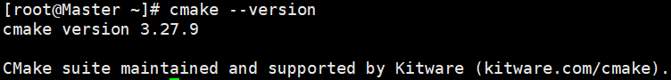
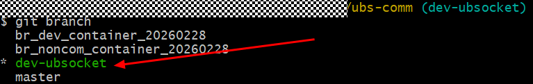
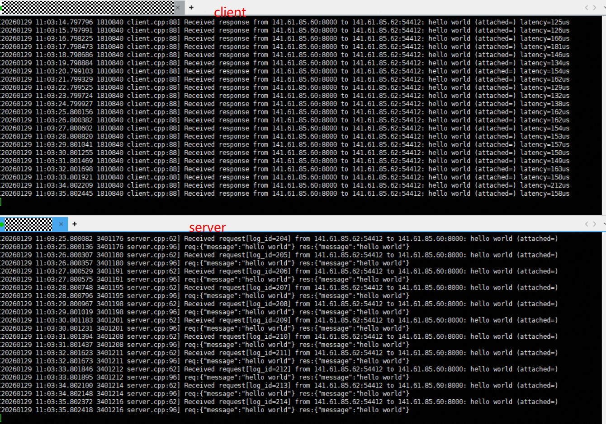

# UBSocket使用手册

## 1 概述

### 1.1 简介

UBSocket通信加速库，支持拦截TCP应用中的POSIX Socket API，将TCP通信转换为UB高性能通信，从而实现通信加速。使用UBSocket，传统TCP应用或TCP通信库可以少修改甚至不修改源码，快速使能UB通信。UBSocket的通信加速能力已经在[bRPC](https://brpc.apache.org/zh/docs/overview/)上验证，并获得性能提升，未来将继续拓展更多场景。

### 1.2 工作原理

UBSocket通信加速库，支持拦截TCP应用中的POSIX Socket API，将TCP通信转换为UB高性能通信，从而实现通信加速。

### 1.3 代码模型

| 目录               | 代码说明                         |
| ------------------ | -------------------------------- |
| ubsocket           | ubsocket代码主目录。             |
| ubsocket/3rdparty  | ubsocket依赖的三方库目录。       |
| ubsocket/brpc      | ubsocket与bRPC适配相关代码目录。 |
| ubsocket/cli       | ubsocket运维相关代码目录。       |
| ubsocket/example   | ubsocket编程样例目录。           |
| ubsocket/unit_test | ubsocket单元测试目录。           |


## 2 配套说明

### 2.1 软件版本配套说明

| 软件名称       | 软件版本                                      |
| :------------- | -------------------------------------------- |
| OS             | 含UB OS Component的OS（OpenEuler-24.03-sp3） |
| GCC            | 14.3.1/13.2.0                                |
| libboundscheck | 1.1.16                                       |
| boringssl      | c00d7ca810e3780bd0c8ee4eea28f4f2ea4bcdc      |

### 2.2 硬件版本配套说明

| 硬件名称 | 硬件规格                           |
| -------- | ---------------------------------- |
| 服务器   | TaiShan 950 SuperPod（鲲鹏超节点） |
| 处理器   | 鲲鹏950                            |


## 3 API和环境变量说明

### 3.1 API说明

UBSocket对外API和原生POSIX接口完全一致，bRPC场景下，截获的API列表如下：

```
int socket(int domain, int type, int protocol);
int close(int fd);
int accept(int socket, struct sockaddr *address, socklen_t *address_len);
int connect(int socket, const struct sockaddr *address, socklen_t address_len);
ssize_t readv(int fildes, const struct iovec *iov, int iovcnt);
ssize_t writev(int fildes, const struct iovec *iov, int iovcnt);
int epoll_create(int size);
int epoll_ctl(int epfd, int op, int fd, struct epoll_event *event);
int epoll_wait(int epfd, struct epoll_event *events, int maxevents, int timeout);
```

### 3.2 环境变量说明

在启动`UBSocket`时，支持通过环境变量进行配置，各环境变量的含义如下。

| 名称                              | 含义                                              | 取值范围                                                     | 默认值            | 必填                                |
| :-------------------------------- | :------------------------------------------------ | :----------------------------------------------------------- | :---------------- | ----------------------------------- |
| UBSOCKET_TRANS_MODE               | 通信协议                                          | ub，ib                                                       | ub                | 否                                  |
| UBSOCKET_DEV_NAME                 | 设备名称                                          | 根据实际场景填写设备名称；例如，udma2或者bonding_dev_0       | NA                | 否                                  |
| UBSOCKET_DEV_IP                   | 设备名称                                          | 根据实际场景填写，支持ipv6和ipv4写法。`ub协议下不需要填写`   | bonding设备       | 否                                  |
| UBSOCKET_EID_IDX                  | 使用普通设备的eid编号                             | ub协议下，通过`urma_admin show`命令查询获得                  | 0                 | `RPC_ADPT_DEV_NAME`为普通设备时必填 |
| UBSOCKET_SRC_EID                  | 使用bonding设备的eid                              | ub协议下，通过`urma_admin show`命令查询获得                  | bonding设备eid    | 否                                  |
| UBSOCKET_LOG_LEVEL                | 日志级别（仅输出大于等于该级别的日志）            | error：错误型<br>warn：警告型<br>notice：提示型<br>info：信息型<br>debug：调试型 | info              | 否                                  |
| UBSOCKET_LOG_USE_PRINTF           | 是否将日志打印到前台                              | true：日志在前台打印<br>false：日志不在前台打印              | true             | 否                                  |
| UBSOCKET_TX_DEPTH                 | 发送队列深度                                      | 最小值是2，设置上限由实际机器环境决定（根据命令`urma_admin show --whole`中`max_jfc_depth`与`max_jfs_depth`两者的最小值） | 1024              | 否                                  |
| UBSOCKET_RX_DEPTH                 | 接受队列深度                                      | 最小值是2，设置上限由实际机器环境决定（根据命令`urma_admin show --whole`中`max_jfc_depth`与`max_jfr_depth`两者的最小值） | 1024              | 否                                  |
| UBSOCKET_READV_UNLIMITED          | 是否打开readv上报限制                             | false，true                                                  | true              | 否                                  |
| UBSOCKET_BLOCK_TYPE               | 内存池的最小分片                                  |default：8k，small：16k，medium：32k，large：64k               | default           | 否                                  |
| UBSOCKET_POOL_INITIAL_SIZE        | IO内存的总大小，单位MB                            | 应用按需配置                                                 | 1024              | 否                                  |
| UBSOCKET_USE_UB_FORCE             | 是否强制使用UB协议加速TCP                         | false：通过接口参数设置socket是否开启UB加速。<br>true：强制所有socket开启UB加速。 | false             | 否                                  |
| UBSOCKET_SCHEDULE_POLICY          | 设置多平面负载分担策略                            | affinity：亲和策略，使用和业务线程所在CPU亲和的IODIE进行UB通信。<br>rr：轮转策略，多个socket采用round robin的策略使用不同IODIE进行UB通信。 | affinity          | 否                                  |
| UBSOCKET_AUTO_FALLBACK_TCP        | 协议不匹配时是否自动降级为TCP                     | false, true                                                  | true              | 否                                  |
| UBSOCKET_TRACE_ENABLE             | 是否打开trace统计                                 | false, true                                                  | true             | 否                                  |
| UBSOCKET_TRACE_TIME               | 控制维测数据输出间隔（单位s）                     | [1, 300]                                                     | 10                | 否                                  |
| UBSOCKET_TRACE_FILE_PATH          | 控制维测数据输出路径                              | [1, 512]                                                     | /tmp/ubsocket/log | 否                                  |
| UBSOCKET_TRACE_FILE_SIZE          | 控制维测数据文件大小（MB）                        | [1, 300]                                                     | 10                | 否                                  |
| UBSOCKET_STATS_CLI                | 是否启用trace cli功能                             | true, false                                                  | false             | 否                                  |
| UBSOCKET_ENABLE_SHARE_JFR         | 设置是否开启共享JFR                               | false, true                                                  | true             | 否                                  |
| UBSOCKET_SHARE_JFR_RX_QUEUE_DEPTH | 设置开启共享JFR后，每个Socket链接接收缓存队列深度 | 最小值是64，设置上限由实际机器环境决定                       | 1024              | 否                                  |
| UBSOCKET_USE_BRPC_ZCOPY           | 是否使用brpc zcopy函数                            | false, true                                                  | true              | 否                                  |
| UBSOCKET_LINK_PRIORITY | 设置流量优先级，按照环境配置映射到SL上 | [0, 15] | 0 | 否 |

> 说明：
>
> - 环境变量仅在通过`LD_PRELOAD`方式使用`UBSocket`时生效；`bRPC`与`UBSocket`集成在一起的场景下，`bRPC`在启动时通过gflags重新设置了全部环境变量的值，故此时各配置的值以gflags的值为准。
> - `UBSocket`支持使用bonding设备和普通udma设备，默认使用bonding设备（不需要用户配置`UBSOCKET_DEV_NAME`、`UBSOCKET_EID_IDX`、`UBSOCKET_DEV_NAME`等）。普通udma设备通常在调试时使用，需通过`urma_admin show`查看设备情况和填充对应信息。

参考如下命令进行环境变量配置即可。

```shell
$ export [-fnp][变量名称]=[变量设置值]
# 例如：执行以下命令表示将UBSocket日志等级设置为error级别。
$ export RPC_ADAPT_LOG_LEVEL=err
```


## 4 构建和运行

UBSocket支持两种构建方式：

- 随bRPC一起通过bazel构建

  随bRPC一起直接编译出可执行文件，如echo\_c++\_client/echo\_c++\_server等。

- 单独通过cmake构建

  编译出librpc_adapter_brpc.so等动态库文件。

> 说明：
>
> ​    对于复杂应用，bazel可以高效的跟踪依赖变化情况及进行增量编译，在实际使用场景中更推荐使用bazel构建。

本章节仅介绍如何通过cmake的方式独立构建，如需使用bazel进行端到端编译，请参考[《brcp_ub编译指导》](https://atomgit.com/fanzhaonan/brpc/blob/develop/docs/cn/bazel_brpc.md)。

### 4.1 软件获取

-   UBSocket软件获取：

    UBSocket在openEuler开源社区获取源码：[UBSocket代码仓](https://atomgit.com/openeuler/ubs-comm/tree/master)

-   UBSocket配套软件获取：

    ```shell
    # 安装openssl
    $ yum install -y openssl
    
    # 安装libboundcheck
    $ yum install -y libboundcheck
    
    # 安装cmake
    $ yum install cmake
    # 通过cmake --version确认是否安装正确
    $ cmake --version
    ```



### 4.2 版本号检查

-   **使用git clone方式下载源码：**

1. 在ubs-comm代码主目录下执行如下命令

```
$ git clone https://atomgit.com/openeuler/ubs-comm.git
$ cd ubs-comm && git branch
```



2. 确认代码分支及commit-id是否正确。

-   **直接下载源码压缩包：**

1. 执行如下命令检查md5值（ubs-comm-master.zip为UBSocket源码压缩包）

```
$ md5sum ubs-comm-master.zip
```

2. 预期显示

```
$ 9c414246b70a3d61a6da314a2bd7c996 *ubs-comm-master.zip
```

3. 确认本地软件包md5值与网站下载到的一致

### 4.3 编程指导

环境变量UBSOCKET\_UB\_FORCE的取值，决定了上层业务如何使用UBSocket。

- UBSOCKET\_UB\_FORCE取值为true

  UBSocket会强制拦截应用中使用到的所有POSIX socket接口，因此业务应用直接对接socket接口编程或者对接基于socket的通信库编程即可。

- UBSOCKET\_UB\_FORCE取值为false

  UBSocket仅拦截特定类型的socket接口（AF_SMC类型），此时需要业务应用手动指定是否开启UB加速。

  ```c++
  #include <sys/socket.h>
  #include <netinet/in.h>
  
  // domain == AF_INET创建tcp类型的socket，不开启UB加速
  int sock = socket(AF_INET, SOCK_STREAM, 0);
  
  // domain == AF_SMC表示开启UB加速
  int sock = socket(AF_SMC, SOCK_STREAM, 0);
  ```

### 4.4 编译构建

`UBSocket`归属于在`UBS Comm`项目，使用了该项目的部分公共能力，故需要分两部分编译。进行源码编译前，请先下载[UBS Comm源码](https://atomgit.com/openeuler/ubs-comm)源码，并切换到目标分支或tag。

```shell
# 编译UMQ
cd ubs-comm/src/hcom/umq
mkdir build && cd build
cmake ..
make -j32
```

完成`UMQ`的编译后，可以得到如下目标编译产物：

- `build/src/libumq.so`
- `build/src/qbuf/libumq_buf.so`
- `build/src/umq_ub/libumq_ub.so`

> 说明：
>
> 在编译UMQ时，可以通过`-DOPENSSL_ROOT_DIR=/path/to/openssl`指定`openssl`路径。

```shell
# 编译ubsocket
cd ubs-comm/src/ubsocket
mkdir build && cd build
cmake ..
make -j32
```

完成`UBSocket`的编译后，可以得到`build/brpc/librpc_adapter_brpc.so`目标编译产物。

> 说明：
>
> 在编译UBSocket时，可以通过`-DUMQ_INCLUDE=/path/to/umq_include -DUMQ_LIB=/path/to/umq_lib`来指定umq的头文件和lib库文件路径（如`=-DUMQ_INCLUDE=/prefix/ubs-comm/src/hcom/umq/include/umq/  -DUMQ_LIB=/prefix/ubs-comm/src/hcom/umq/build/src/libumq.so`）。
> 默认情况下，ubsocket 会构建 `socket`, `accept`, `connect` 等 posix socket API 的覆盖，如果你的应用程序已使用 `ubsocket_socket`, `ubsocket_accept` 这些带有 `ubsocket_` 前缀的 API，那么可以使用 `-DUBSOCKET_ENABLE_INTERCEPT=OFF` 来关闭 `socket`, `accept` 和 `connect` 等 posix socket API 的生成以减少影响面。

### 4.5 用例执行

参考4.4节中cmake构建方式，以echo\_c++\_server和echo\_c++\_client为例，通过如下命令启动开启UB加速能力：

```shell
$ export LD_PRELOAD=librpc_adapter_brpc.so
$ export UBSOCKET_LOG_USE_PRINTF=true
$ export UBSOCKET_UB_FORCE=true
$ ./echo_c++_srever  # 或者./echo_c++_client
```

启动完成以后，执行成功的截图如下所示。




## 5 日志

### 5.1 日志目录

UBSocket提供了两种日志输出方式，如通过环境变量UBSOCKET\_LOG\_USE\_PRINTF进行配置。

-   如果UBSOCKET\_LOG\_PRINTF=true，则UBSocket日志直接打屏显示，业务可以讲日志信息重定向到指定文件中
-   如果UBSOCKET\_LOG\_PRINTF=false，则UBSocket日志打印在/var/log/messages中

### 5.2 日志格式

-   UBSocket日志格式如下：

```
时间戳 [线程ID] | 日志等级 | UBSOCKET | 错误类型 | 函数名[代码行号] | 日志信息
```

>说明： 
>-   日志等级：包括ERROR, WARNING, NOTICE, INFO, DEBUG
>-   错误类型：包括UMQ_AE, UMQ_API, UMQ_CQE, UBSocket，其中非ERROR级别固定为UBSocket
>-   函数名：上报该日志的函数名
>-   代码行号：上报该日志的代码行号
>-   日志信息：该行记录对应的日志信息，包括异常信息说明等

## 6 运维指标采集

### 6.1 目的

本章节内容用于指导运维人员通过容器内部署日志采集组件agent，如Filebeat，采集UB socket软件定时输出的流量数据，确保数据可正常对接客户自有运维系统，实现流量数据的监控、分析与告警闭环

### 6.2 前置条件

在采集性能数据前，需要确保如下条件已经满足，避免数据采集异常

-   容器环境已正常部署，且容器可正常启动、运行
-   容器内已部署日志采集agnet，如filebeat等，日志采集组件可正常启动，且具备目标数据文件的读取权限
-   容器内已安装UB socket软件，且软件配置正常，可定时输出流量数据至指定文件

### 6.3 容器环境变量设置

容器拉起时需配置以下环境变量，确保UB socket软件正常输出流量日志，用于容器内agent采集数据，各环境变量默认值及配置要求如下

**表 6-1**  环境变量说明

<table><thead align="left"><tr id="row1717452618514"><th class="cellrowborder" valign="top" width="23.11768823117688%" id="mcps1.2.6.1.1"><p id="p93616105514"><a name="p93616105514"></a><a name="p93616105514"></a>环境变量名</p>
</th>
<th class="cellrowborder" valign="top" width="7.519248075192481%" id="mcps1.2.6.1.2"><p id="p1620544413615"><a name="p1620544413615"></a><a name="p1620544413615"></a>参数取值</p>
</th>
<th class="cellrowborder" valign="top" width="14.44855514448555%" id="mcps1.2.6.1.3"><p id="p73613107517"><a name="p73613107517"></a><a name="p73613107517"></a>默认值</p>
</th>
<th class="cellrowborder" valign="top" width="25.72742725727427%" id="mcps1.2.6.1.4"><p id="p03611810959"><a name="p03611810959"></a><a name="p03611810959"></a>说明</p>
</th>
<th class="cellrowborder" valign="top" width="29.187081291870815%" id="mcps1.2.6.1.5"><p id="p336120100518"><a name="p336120100518"></a><a name="p336120100518"></a>配置要求</p>
</th>
</tr>
</thead>
<tbody><tr id="row71744264512"><td class="cellrowborder" valign="top" width="23.11768823117688%" headers="mcps1.2.6.1.1 "><p id="p1036112101156"><a name="p1036112101156"></a><a name="p1036112101156"></a>UBSOCKET_TRACE_ENABLE</p>
</td>
<td class="cellrowborder" valign="top" width="7.519248075192481%" headers="mcps1.2.6.1.2 "><p id="p820513440611"><a name="p820513440611"></a><a name="p820513440611"></a>true/false</p>
</td>
<td class="cellrowborder" valign="top" width="14.44855514448555%" headers="mcps1.2.6.1.3 "><p id="p63612010859"><a name="p63612010859"></a><a name="p63612010859"></a>true</p>
</td>
<td class="cellrowborder" valign="top" width="25.72742725727427%" headers="mcps1.2.6.1.4 "><p id="p11362141018517"><a name="p11362141018517"></a><a name="p11362141018517"></a>控制UB socket流量指标采集功能的开启/关闭</p>
</td>
<td class="cellrowborder" valign="top" width="29.187081291870815%" headers="mcps1.2.6.1.5 "><p id="p43626107515"><a name="p43626107515"></a><a name="p43626107515"></a>默认设置为true。手动设置为false时无法输出日志供Filebeat采集</p>
</td>
</tr>
<tr id="row191745262519"><td class="cellrowborder" valign="top" width="23.11768823117688%" headers="mcps1.2.6.1.1 "><p id="p2036215101151"><a name="p2036215101151"></a><a name="p2036215101151"></a>UBSOCKET_TRACE_TIME</p>
</td>
<td class="cellrowborder" valign="top" width="7.519248075192481%" headers="mcps1.2.6.1.2 "><p id="p4205044664"><a name="p4205044664"></a><a name="p4205044664"></a>[1,300]</p>
</td>
<td class="cellrowborder" valign="top" width="14.44855514448555%" headers="mcps1.2.6.1.3 "><p id="p183620101355"><a name="p183620101355"></a><a name="p183620101355"></a>10s</p>
</td>
<td class="cellrowborder" valign="top" width="25.72742725727427%" headers="mcps1.2.6.1.4 "><p id="p1636216106512"><a name="p1636216106512"></a><a name="p1636216106512"></a>UB socket流量数据的输出时间间隔</p>
</td>
<td class="cellrowborder" valign="top" width="29.187081291870815%" headers="mcps1.2.6.1.5 "><p id="p17362810455"><a name="p17362810455"></a><a name="p17362810455"></a>默认10秒，可根据客户监控需求调整</p>
</td>
</tr>
<tr id="row41751726458"><td class="cellrowborder" valign="top" width="23.11768823117688%" headers="mcps1.2.6.1.1 "><p id="p836211101557"><a name="p836211101557"></a><a name="p836211101557"></a>UBSOCKET_TRACE_FILE_PATH</p>
</td>
<td class="cellrowborder" valign="top" width="7.519248075192481%" headers="mcps1.2.6.1.2 "><p id="p18205644861"><a name="p18205644861"></a><a name="p18205644861"></a>路径字符长度小于512bytes</p>
</td>
<td class="cellrowborder" valign="top" width="14.44855514448555%" headers="mcps1.2.6.1.3 "><p id="p23625101553"><a name="p23625101553"></a><a name="p23625101553"></a>/tmp/ubsocket/log</p>
</td>
<td class="cellrowborder" valign="top" width="25.72742725727427%" headers="mcps1.2.6.1.4 "><p id="p036214101255"><a name="p036214101255"></a><a name="p036214101255"></a>UB socket流量指标文件的输出根路径</p>
</td>
<td class="cellrowborder" valign="top" width="29.187081291870815%" headers="mcps1.2.6.1.5 "><p id="p1136241012510"><a name="p1136241012510"></a><a name="p1136241012510"></a>默认路径可直接使用，若自定义路径，需确保Filebeat具备该路径的读取权限</p>
</td>
</tr>
<tr id="row124816106207"><td class="cellrowborder" valign="top" width="23.11768823117688%" headers="mcps1.2.6.1.1 "><p id="p1548261015207"><a name="p1548261015207"></a><a name="p1548261015207"></a>UBSOCKET_TRACE_FILE_SIZE</p>
</td>
<td class="cellrowborder" valign="top" width="7.519248075192481%" headers="mcps1.2.6.1.2 "><p id="p1648261020209"><a name="p1648261020209"></a><a name="p1648261020209"></a>[1,300]</p>
</td>
<td class="cellrowborder" valign="top" width="14.44855514448555%" headers="mcps1.2.6.1.3 "><p id="p4482141052019"><a name="p4482141052019"></a><a name="p4482141052019"></a>10MB</p>
</td>
<td class="cellrowborder" valign="top" width="25.72742725727427%" headers="mcps1.2.6.1.4 "><p id="p2482210182011"><a name="p2482210182011"></a><a name="p2482210182011"></a>控制UB Socket输出流量指标文件的大小</p>
</td>
<td class="cellrowborder" valign="top" width="29.187081291870815%" headers="mcps1.2.6.1.5 "><p id="p24820106206"><a name="p24820106206"></a><a name="p24820106206"></a>默认10MB，可根据客户监控需求调整；超过大小指标文件会进程转储，转储文件格式为ubsocket_kpi_timestamp.json</p>
</td>
</tr>
</tbody>
</table>

```shell
$ # 开启UB socket流量指标采集功能
$ export UBSOCKET_TRACE_ENABLE=true
```

### 6.4 文件内容说明

开启UB socket流量指标采集功能后，UB socket会定期输出性能数据，其中格式和内容如下：

-   文件输出路径：默认路径为/tmp/ubsocket/log/，支持通过环境变量指定路径
-   文件名称：ubsocket\_kpi\.json; 容器内存在多个ubsockt进程时，每个UB socket会输出到同一份文件
-   文件权限：640
-   文件转储：日志文件超过10M后自动归档，由客户容器内的日志agent负责文件的删除
-   文件格式：输出文件为一个json格式格式内容，格式如下：

    ```json
    {"timeStamp":"2026-02-05 14:00:00","trafficRecords":{"totalConnections":58,"activeConnections":32,"sendPackets":1245,"receivePackets":987,"sendBytes":156892,"receiveBytes":102456,"errorPackets":0,"lostPackets":0}}
    {"timeStamp":"2026-02-05 14:00:10","trafficRecords":{"totalConnections":61,"activeConnections":35,"sendPackets":1321,"receivePackets":1053,"sendBytes":168945,"receiveBytes":110238,"errorPackets":0,"lostPackets":0}}
    ```

**表 6-2**  json格式字段说明

<table><thead align="left"><tr id="row61858237390"><th class="cellrowborder" valign="top" width="25%" id="mcps1.2.5.1.1"><p id="p4185223183913"><a name="p4185223183913"></a><a name="p4185223183913"></a>数据字段</p>
</th>
<th class="cellrowborder" valign="top" width="25%" id="mcps1.2.5.1.2"><p id="p7965354194420"><a name="p7965354194420"></a><a name="p7965354194420"></a>中文名称</p>
</th>
<th class="cellrowborder" valign="top" width="12.15%" id="mcps1.2.5.1.3"><p id="p15185123153914"><a name="p15185123153914"></a><a name="p15185123153914"></a>单位</p>
</th>
<th class="cellrowborder" valign="top" width="37.85%" id="mcps1.2.5.1.4"><p id="p1185112310391"><a name="p1185112310391"></a><a name="p1185112310391"></a>指标说明</p>
</th>
</tr>
</thead>
<tbody><tr id="row973393711314"><td class="cellrowborder" valign="top" width="25%" headers="mcps1.2.5.1.1 "><p id="p1856831218147"><a name="p1856831218147"></a><a name="p1856831218147"></a>timeStamp</p>
</td>
<td class="cellrowborder" valign="top" width="25%" headers="mcps1.2.5.1.2 "><p id="p146151912146"><a name="p146151912146"></a><a name="p146151912146"></a>数据采集时间</p>
</td>
<td class="cellrowborder" valign="top" width="12.15%" headers="mcps1.2.5.1.3 "><p id="p392982461414"><a name="p392982461414"></a><a name="p392982461414"></a>时间戳（yyyy-MM-dd HH:mm:ss）</p>
</td>
<td class="cellrowborder" valign="top" width="37.85%" headers="mcps1.2.5.1.4 "><p id="p638616325147"><a name="p638616325147"></a><a name="p638616325147"></a>记录UB socket本次采集流量数据的具体时间，用于运维系统追溯数据时序、关联同期指标</p>
</td>
</tr>
<tr id="row518512315399"><td class="cellrowborder" valign="top" width="25%" headers="mcps1.2.5.1.1 "><p id="p1615765913141"><a name="p1615765913141"></a><a name="p1615765913141"></a>totalConnections</p>
</td>
<td class="cellrowborder" valign="top" width="25%" headers="mcps1.2.5.1.2 "><p id="p14185523143915"><a name="p14185523143915"></a><a name="p14185523143915"></a>UB socket主动打开连接数</p>
</td>
<td class="cellrowborder" valign="top" width="12.15%" headers="mcps1.2.5.1.3 "><p id="p191855238399"><a name="p191855238399"></a><a name="p191855238399"></a>个</p>
</td>
<td class="cellrowborder" valign="top" width="37.85%" headers="mcps1.2.5.1.4 "><p id="p218502373916"><a name="p218502373916"></a><a name="p218502373916"></a>UB socket总连接数量</p>
</td>
</tr>
<tr id="row91864232394"><td class="cellrowborder" valign="top" width="25%" headers="mcps1.2.5.1.1 "><p id="p14157159171411"><a name="p14157159171411"></a><a name="p14157159171411"></a>activeConnections</p>
</td>
<td class="cellrowborder" valign="top" width="25%" headers="mcps1.2.5.1.2 "><p id="p1418611237393"><a name="p1418611237393"></a><a name="p1418611237393"></a>UB socket连接数</p>
</td>
<td class="cellrowborder" valign="top" width="12.15%" headers="mcps1.2.5.1.3 "><p id="p11862236399"><a name="p11862236399"></a><a name="p11862236399"></a>个</p>
</td>
<td class="cellrowborder" valign="top" width="37.85%" headers="mcps1.2.5.1.4 "><p id="p191861523183919"><a name="p191861523183919"></a><a name="p191861523183919"></a>UB socket作为客户端主动发起的连接数量</p>
</td>
</tr>
<tr id="row181864237392"><td class="cellrowborder" valign="top" width="25%" headers="mcps1.2.5.1.1 "><p id="p815775916144"><a name="p815775916144"></a><a name="p815775916144"></a>sendPackets</p>
</td>
<td class="cellrowborder" valign="top" width="25%" headers="mcps1.2.5.1.2 "><p id="p141861023183914"><a name="p141861023183914"></a><a name="p141861023183914"></a>UB socket发送包数</p>
</td>
<td class="cellrowborder" valign="top" width="12.15%" headers="mcps1.2.5.1.3 "><p id="p1184515551977"><a name="p1184515551977"></a><a name="p1184515551977"></a>pkg/s</p>
</td>
<td class="cellrowborder" valign="top" width="37.85%" headers="mcps1.2.5.1.4 "><p id="p01865233399"><a name="p01865233399"></a><a name="p01865233399"></a>本次采集周期内UB socket发送报文数量</p>
</td>
</tr>
<tr id="row974012507424"><td class="cellrowborder" valign="top" width="25%" headers="mcps1.2.5.1.1 "><p id="p615765911146"><a name="p615765911146"></a><a name="p615765911146"></a>receivePackets</p>
</td>
<td class="cellrowborder" valign="top" width="25%" headers="mcps1.2.5.1.2 "><p id="p35021059194217"><a name="p35021059194217"></a><a name="p35021059194217"></a>UB socket接收包数</p>
</td>
<td class="cellrowborder" valign="top" width="12.15%" headers="mcps1.2.5.1.3 "><p id="p16858195517710"><a name="p16858195517710"></a><a name="p16858195517710"></a>pkg/s</p>
</td>
<td class="cellrowborder" valign="top" width="37.85%" headers="mcps1.2.5.1.4 "><p id="p398214173477"><a name="p398214173477"></a><a name="p398214173477"></a>本次采集周期内UB socket接收报文数量</p>
</td>
</tr>
<tr id="row69135610427"><td class="cellrowborder" valign="top" width="25%" headers="mcps1.2.5.1.1 "><p id="p1115725981412"><a name="p1115725981412"></a><a name="p1115725981412"></a>sendBytes</p>
</td>
<td class="cellrowborder" valign="top" width="25%" headers="mcps1.2.5.1.2 "><p id="p0910567423"><a name="p0910567423"></a><a name="p0910567423"></a>UB socket发送字节数</p>
</td>
<td class="cellrowborder" valign="top" width="12.15%" headers="mcps1.2.5.1.3 "><p id="p1395569421"><a name="p1395569421"></a><a name="p1395569421"></a>bytes/s</p>
</td>
<td class="cellrowborder" valign="top" width="37.85%" headers="mcps1.2.5.1.4 "><p id="p48143256479"><a name="p48143256479"></a><a name="p48143256479"></a>单位时间内UB socket发送的总数据量</p>
</td>
</tr>
<tr id="row6375653104213"><td class="cellrowborder" valign="top" width="25%" headers="mcps1.2.5.1.1 "><p id="p215785916148"><a name="p215785916148"></a><a name="p215785916148"></a>receiveBytes</p>
</td>
<td class="cellrowborder" valign="top" width="25%" headers="mcps1.2.5.1.2 "><p id="p18516162164415"><a name="p18516162164415"></a><a name="p18516162164415"></a>UB socket接收字节数</p>
</td>
<td class="cellrowborder" valign="top" width="12.15%" headers="mcps1.2.5.1.3 "><p id="p212710451719"><a name="p212710451719"></a><a name="p212710451719"></a>bytes/s</p>
</td>
<td class="cellrowborder" valign="top" width="37.85%" headers="mcps1.2.5.1.4 "><p id="p1581432534718"><a name="p1581432534718"></a><a name="p1581432534718"></a>单位时间内UB socket接收的总数据量</p>
</td>
</tr>
<tr id="row1423119440"><td class="cellrowborder" valign="top" width="25%" headers="mcps1.2.5.1.1 "><p id="p615795918147"><a name="p615795918147"></a><a name="p615795918147"></a>errorPackets</p>
</td>
<td class="cellrowborder" valign="top" width="25%" headers="mcps1.2.5.1.2 "><p id="p108312418441"><a name="p108312418441"></a><a name="p108312418441"></a>UB socket传输错误包数</p>
</td>
<td class="cellrowborder" valign="top" width="12.15%" headers="mcps1.2.5.1.3 "><p id="p283317399457"><a name="p283317399457"></a><a name="p283317399457"></a>pkg/s</p>
</td>
<td class="cellrowborder" valign="top" width="37.85%" headers="mcps1.2.5.1.4 "><p id="p20221184414"><a name="p20221184414"></a><a name="p20221184414"></a>单位时间内出现的传输错误报文数量</p>
</td>
</tr>
<tr id="row1423119440"><td class="cellrowborder" valign="top" width="25%" headers="mcps1.2.5.1.1 "><p id="p615795918147"><a name="p615795918147"></a><a name="p615795918147"></a>lostPackets</p>
</td>
<td class="cellrowborder" valign="top" width="25%" headers="mcps1.2.5.1.2 "><p id="p108312418441"><a name="p108312418441"></a><a name="p108312418441"></a>UB socket传输丢失包数</p>
</td>
<td class="cellrowborder" valign="top" width="12.15%" headers="mcps1.2.5.1.3 "><p id="p283317399457"><a name="p283317399457"></a><a name="p283317399457"></a>pkg/s</p>
</td>
<td class="cellrowborder" valign="top" width="37.85%" headers="mcps1.2.5.1.4 "><p id="p20221184414"><a name="p20221184414"></a><a name="p20221184414"></a>单位时间内出现的传输丢失报文数量</p>
</td>
</tr>
</tbody>
</table>

### 6.5 数据采集配置说明

-   数据采集：由客户在容器内部署agent，读取文件并解析最新的数据
-   数据处理：
    -   每次读取最新的数据，并按照json格式进行解析获取相关kpi指标
    -   若容器内存在多个UB socket进程，将生成多个对应进程ID的指标文件（即多个ubsocket\_kpi\_<pid\>.json文件），需客户在运维系统侧做指标汇聚处理，将多个进程的指标相加，汇总为一个容器维度的整体指标

## 7 错误码含义和处理建议

UBSocket接口返回值含义与原生Socket接口保持一致，返回-1表示失败。如果失败的话，通过errno表示错误类型。UBSocket返回的errno与LINUX原生errno也保持一致，UBSocket重载了如下9个POSIX socket接口，部分接口中会存在UB异常导致的报错，该类错误也通过errno返回，使用方需要格外关注，错误码整体含义和处理建议如下：

**表 7-1** 

<table><thead align="left"><tr id="row9901059132618"><th class="cellrowborder" valign="top" width="10.69%" id="mcps1.2.6.1.1"><p id="p1590145912262"><a name="p1590145912262"></a><a name="p1590145912262"></a>接口</p>
</th>
<th class="cellrowborder" valign="top" width="13.530000000000001%" id="mcps1.2.6.1.2"><p id="p8706122724910"><a name="p8706122724910"></a><a name="p8706122724910"></a>是否涉及UB异常报错</p>
</th>
<th class="cellrowborder" valign="top" width="10.95%" id="mcps1.2.6.1.3"><p id="p164229138270"><a name="p164229138270"></a><a name="p164229138270"></a>errno</p>
</th>
<th class="cellrowborder" valign="top" width="35.14%" id="mcps1.2.6.1.4"><p id="p79014593265"><a name="p79014593265"></a><a name="p79014593265"></a>含义</p>
</th>
<th class="cellrowborder" valign="top" width="29.69%" id="mcps1.2.6.1.5"><p id="p209011459192620"><a name="p209011459192620"></a><a name="p209011459192620"></a>处理建议</p>
</th>
</tr>
</thead>
<tbody><tr id="row1490175911268"><td class="cellrowborder" valign="top" width="10.69%" headers="mcps1.2.6.1.1 "><p id="p1390115591265"><a name="p1390115591265"></a><a name="p1390115591265"></a>socket</p>
</td>
<td class="cellrowborder" valign="top" width="13.530000000000001%" headers="mcps1.2.6.1.2 "><p id="p070616275498"><a name="p070616275498"></a><a name="p070616275498"></a>否</p>
</td>
<td class="cellrowborder" valign="top" width="10.95%" headers="mcps1.2.6.1.3 "><p id="p17901359202615"><a name="p17901359202615"></a><a name="p17901359202615"></a>同系统API错误码</p>
</td>
<td class="cellrowborder" valign="top" width="35.14%" headers="mcps1.2.6.1.4 "><p id="p17901105915269"><a name="p17901105915269"></a><a name="p17901105915269"></a>本接口内部不涉及UB相关接口调用，出现异常后为系统API调用出错，errno含义同系统API错误</p>
</td>
<td class="cellrowborder" valign="top" width="29.69%" headers="mcps1.2.6.1.5 "><p id="p5901125962610"><a name="p5901125962610"></a><a name="p5901125962610"></a>对照原生系统API报错处理建议进行排查，比如：返回<span>EMFILE</span>表示当前进程打开的文件描述符达到上限</p>
</td>
</tr>
<tr id="row179016592267"><td class="cellrowborder" valign="top" width="10.69%" headers="mcps1.2.6.1.1 "><p id="p15901115932617"><a name="p15901115932617"></a><a name="p15901115932617"></a>close</p>
</td>
<td class="cellrowborder" valign="top" width="13.530000000000001%" headers="mcps1.2.6.1.2 "><p id="p111823111718"><a name="p111823111718"></a><a name="p111823111718"></a>否</p>
</td>
<td class="cellrowborder" valign="top" width="10.95%" headers="mcps1.2.6.1.3 "><p id="p6182411116"><a name="p6182411116"></a><a name="p6182411116"></a>同系统API错误码</p>
</td>
<td class="cellrowborder" valign="top" width="35.14%" headers="mcps1.2.6.1.4 "><p id="p201821611416"><a name="p201821611416"></a><a name="p201821611416"></a>本接口内部不涉及UB相关接口调用，出现异常后为系统API调用出错，errno含义同系统API错误</p>
</td>
<td class="cellrowborder" valign="top" width="29.69%" headers="mcps1.2.6.1.5 "><p id="p131825111319"><a name="p131825111319"></a><a name="p131825111319"></a>对照原生系统API报错处理建议进行排查，比如：返回EBADF表示fd无效</p>
</td>
</tr>
<tr id="row179013595268"><td class="cellrowborder" rowspan="3" valign="top" width="10.69%" headers="mcps1.2.6.1.1 "><p id="p10901185914262"><a name="p10901185914262"></a><a name="p10901185914262"></a>connect</p>
<p id="p07981061585"><a name="p07981061585"></a><a name="p07981061585"></a></p>
<p id="p1851944518176"><a name="p1851944518176"></a><a name="p1851944518176"></a></p>
</td>
<td class="cellrowborder" rowspan="3" valign="top" width="13.530000000000001%" headers="mcps1.2.6.1.2 "><p id="p87061427164916"><a name="p87061427164916"></a><a name="p87061427164916"></a>是</p>
<p id="p37988618819"><a name="p37988618819"></a><a name="p37988618819"></a></p>
<p id="p105191245111716"><a name="p105191245111716"></a><a name="p105191245111716"></a></p>
</td>
<td class="cellrowborder" valign="top" width="10.95%" headers="mcps1.2.6.1.3 "><p id="p1590155952611"><a name="p1590155952611"></a><a name="p1590155952611"></a>ETIMEOUT</p>
</td>
<td class="cellrowborder" valign="top" width="35.14%" headers="mcps1.2.6.1.4 "><p id="p2901185972614"><a name="p2901185972614"></a><a name="p2901185972614"></a>通过TCP连接交换UB信息超时，结合UBSocket错误日志有类似"Failed to send...", "Failed to exchange"等相关错误信息进行佐证</p>
</td>
<td class="cellrowborder" valign="top" width="29.69%" headers="mcps1.2.6.1.5 "><p id="p39021593267"><a name="p39021593267"></a><a name="p39021593267"></a>检查TCP/IP发包是否正常</p>
</td>
</tr>
<tr id="row1179876788"><td class="cellrowborder" valign="top" headers="mcps1.2.6.1.1 "><p id="p16798166489"><a name="p16798166489"></a><a name="p16798166489"></a>EIO</p>
</td>
<td class="cellrowborder" valign="top" headers="mcps1.2.6.1.2 "><p id="p179896686"><a name="p179896686"></a><a name="p179896686"></a>1. 创建UB资源失败，结合UBSocket错误日志"Failed to create..."错误信息进行佐证</p>
<p id="p9113111111145"><a name="p9113111111145"></a><a name="p9113111111145"></a>2. UB建连失败，结合UBSocket错误日志"Failed to execute umq_bind"错误信息进行佐证</p>
</td>
<td class="cellrowborder" valign="top" headers="mcps1.2.6.1.3 "><p id="p5178129141515"><a name="p5178129141515"></a><a name="p5178129141515"></a>1. 查看UB设备状态是否正常（执行urma_admin show查看UB设备是否存在，EID是否存在）</p>
<p id="p0159151818165"><a name="p0159151818165"></a><a name="p0159151818165"></a>2. 执行urma_ping检查UB链路是否正常</p>
</td>
</tr>
<tr id="row451904518179"><td class="cellrowborder" valign="top" headers="mcps1.2.6.1.1 "><p id="p151914512170"><a name="p151914512170"></a><a name="p151914512170"></a>ENOMEM</p>
</td>
<td class="cellrowborder" valign="top" headers="mcps1.2.6.1.2 "><p id="p155191145191716"><a name="p155191145191716"></a><a name="p155191145191716"></a>下发UB接收缓存buffer失败，一般是无可用内存了，结合UBSocket错误日志"Failed to fill rx buffer..."进行佐证</p>
</td>
<td class="cellrowborder" valign="top" headers="mcps1.2.6.1.3 "><p id="p16519124516174"><a name="p16519124516174"></a><a name="p16519124516174"></a>1. 检查内存是否充足</p>
</td>
</tr>
<tr id="row790218596261"><td class="cellrowborder" rowspan="3" valign="top" width="10.69%" headers="mcps1.2.6.1.1 "><p id="p1190214595260"><a name="p1190214595260"></a><a name="p1190214595260"></a>accept</p>
<p id="p14211112116209"><a name="p14211112116209"></a><a name="p14211112116209"></a></p>
<p id="p983814234209"><a name="p983814234209"></a><a name="p983814234209"></a></p>
</td>
<td class="cellrowborder" rowspan="3" valign="top" width="13.530000000000001%" headers="mcps1.2.6.1.2 "><p id="p20706172724911"><a name="p20706172724911"></a><a name="p20706172724911"></a>是</p>
<p id="p121172115208"><a name="p121172115208"></a><a name="p121172115208"></a></p>
<p id="p283872315206"><a name="p283872315206"></a><a name="p283872315206"></a></p>
</td>
<td class="cellrowborder" valign="top" width="10.95%" headers="mcps1.2.6.1.3 "><p id="p13902175911263"><a name="p13902175911263"></a><a name="p13902175911263"></a>ETIMEDOUT</p>
</td>
<td class="cellrowborder" valign="top" width="35.14%" headers="mcps1.2.6.1.4 "><p id="p5319152814202"><a name="p5319152814202"></a><a name="p5319152814202"></a>通过TCP连接交换UB信息超时，结合UBSocket错误日志有类似"Failed to send...", "Failed to exchange"等相关错误信息进行佐证</p>
</td>
<td class="cellrowborder" valign="top" width="29.69%" headers="mcps1.2.6.1.5 "><p id="p1841123214203"><a name="p1841123214203"></a><a name="p1841123214203"></a>检查TCP/IP发包是否正常</p>
</td>
</tr>
<tr id="row32117216203"><td class="cellrowborder" valign="top" headers="mcps1.2.6.1.1 "><p id="p532216112213"><a name="p532216112213"></a><a name="p532216112213"></a>EIO</p>
</td>
<td class="cellrowborder" valign="top" headers="mcps1.2.6.1.2 "><p id="p143221211192114"><a name="p143221211192114"></a><a name="p143221211192114"></a>1. 创建UB资源失败，结合UBSocket错误日志"Failed to create..."错误信息进行佐证</p>
<p id="p1232251112113"><a name="p1232251112113"></a><a name="p1232251112113"></a>2. UB建连失败，结合UBSocket错误日志"Failed to execute umq_bind"错误信息进行佐证</p>
</td>
<td class="cellrowborder" valign="top" headers="mcps1.2.6.1.3 "><p id="p132215114214"><a name="p132215114214"></a><a name="p132215114214"></a>1. 查看UB设备状态是否正常（执行urma_admin show查看UB设备是否存在，EID是否存在）</p>
<p id="p53221411102117"><a name="p53221411102117"></a><a name="p53221411102117"></a>2. 执行urma_ping检查UB链路是否正常</p>
</td>
</tr>
<tr id="row148371023182018"><td class="cellrowborder" valign="top" headers="mcps1.2.6.1.1 "><p id="p1132291119211"><a name="p1132291119211"></a><a name="p1132291119211"></a>ENOMEM</p>
</td>
<td class="cellrowborder" valign="top" headers="mcps1.2.6.1.2 "><p id="p1832201172113"><a name="p1832201172113"></a><a name="p1832201172113"></a>下发UB接收缓存buffer失败，一般是无可用内存了，结合UBSocket错误日志"Failed to fill rx buffer..."进行佐证</p>
</td>
<td class="cellrowborder" valign="top" headers="mcps1.2.6.1.3 "><p id="p732271162113"><a name="p732271162113"></a><a name="p732271162113"></a>1. 检查内存是否充足</p>
</td>
</tr>
<tr id="row1490285992610"><td class="cellrowborder" rowspan="4" valign="top" width="10.69%" headers="mcps1.2.6.1.1 "><p id="p159021159182614"><a name="p159021159182614"></a><a name="p159021159182614"></a>readv</p>
<p id="p6310105712337"><a name="p6310105712337"></a><a name="p6310105712337"></a></p>
<p id="p17174123345"><a name="p17174123345"></a><a name="p17174123345"></a></p>
<p id="p141091230133913"><a name="p141091230133913"></a><a name="p141091230133913"></a></p>
</td>
<td class="cellrowborder" rowspan="4" valign="top" width="13.530000000000001%" headers="mcps1.2.6.1.2 "><p id="p197061427194916"><a name="p197061427194916"></a><a name="p197061427194916"></a>是</p>
<p id="p12310857163310"><a name="p12310857163310"></a><a name="p12310857163310"></a></p>
<p id="p181753214348"><a name="p181753214348"></a><a name="p181753214348"></a></p>
<p id="p0109103043912"><a name="p0109103043912"></a><a name="p0109103043912"></a></p>
</td>
<td class="cellrowborder" valign="top" width="10.95%" headers="mcps1.2.6.1.3 "><p id="p12691640103310"><a name="p12691640103310"></a><a name="p12691640103310"></a>EINVAL</p>
</td>
<td class="cellrowborder" valign="top" width="35.14%" headers="mcps1.2.6.1.4 "><p id="p162695405335"><a name="p162695405335"></a><a name="p162695405335"></a>发送数据包的长度为0或者地址异常</p>
</td>
<td class="cellrowborder" valign="top" width="29.69%" headers="mcps1.2.6.1.5 "><p id="p426954016339"><a name="p426954016339"></a><a name="p426954016339"></a>检查接收数据的参数是否异常</p>
</td>
</tr>
<tr id="row173101757113314"><td class="cellrowborder" valign="top" headers="mcps1.2.6.1.1 "><p id="p331013573335"><a name="p331013573335"></a><a name="p331013573335"></a>EIO</p>
</td>
<td class="cellrowborder" valign="top" headers="mcps1.2.6.1.2 "><p id="p5310155733318"><a name="p5310155733318"></a><a name="p5310155733318"></a>1. URMA发包，poll完成事件失败</p>
<p id="p6210192593519"><a name="p6210192593519"></a><a name="p6210192593519"></a>2. 重新向接收队列缓存下发接收buffer失败</p>
</td>
<td class="cellrowborder" valign="top" headers="mcps1.2.6.1.3 "><p id="p203102572330"><a name="p203102572330"></a><a name="p203102572330"></a>1. 连接故障，需要重新建连</p>
<p id="p1948135813377"><a name="p1948135813377"></a><a name="p1948135813377"></a>2. 检查内存是否充足</p>
</td>
</tr>
<tr id="row111748293413"><td class="cellrowborder" valign="top" headers="mcps1.2.6.1.1 "><p id="p217517213345"><a name="p217517213345"></a><a name="p217517213345"></a>EINTR</p>
</td>
<td class="cellrowborder" valign="top" headers="mcps1.2.6.1.2 "><p id="p17175112173415"><a name="p17175112173415"></a><a name="p17175112173415"></a>读取数据时有其他事件上报导致中断（操作系统正常行为）</p>
</td>
<td class="cellrowborder" valign="top" headers="mcps1.2.6.1.3 "><p id="p81754223410"><a name="p81754223410"></a><a name="p81754223410"></a>进行重试</p>
</td>
</tr>
<tr id="row1110973015394"><td class="cellrowborder" valign="top" headers="mcps1.2.6.1.1 "><p id="p18109113016393"><a name="p18109113016393"></a><a name="p18109113016393"></a>EAGAIN</p>
</td>
<td class="cellrowborder" valign="top" headers="mcps1.2.6.1.2 "><p id="p19109830173920"><a name="p19109830173920"></a><a name="p19109830173920"></a>暂无可读数据</p>
</td>
<td class="cellrowborder" valign="top" headers="mcps1.2.6.1.3 "><p id="p1110963019391"><a name="p1110963019391"></a><a name="p1110963019391"></a>等待后续可读事件到达</p>
</td>
</tr>
<tr id="row41414215305"><td class="cellrowborder" rowspan="4" valign="top" width="10.69%" headers="mcps1.2.6.1.1 "><p id="p414162114307"><a name="p414162114307"></a><a name="p414162114307"></a>writev</p>
<p id="p1460832872315"><a name="p1460832872315"></a><a name="p1460832872315"></a></p>
<p id="p567917304239"><a name="p567917304239"></a><a name="p567917304239"></a></p>
<p id="p173928143117"><a name="p173928143117"></a><a name="p173928143117"></a></p>
</td>
<td class="cellrowborder" rowspan="4" valign="top" width="13.530000000000001%" headers="mcps1.2.6.1.2 "><p id="p7706122784919"><a name="p7706122784919"></a><a name="p7706122784919"></a>是</p>
<p id="p106081228152311"><a name="p106081228152311"></a><a name="p106081228152311"></a></p>
<p id="p0679123020238"><a name="p0679123020238"></a><a name="p0679123020238"></a></p>
<p id="p131828163110"><a name="p131828163110"></a><a name="p131828163110"></a></p>
</td>
<td class="cellrowborder" valign="top" width="10.95%" headers="mcps1.2.6.1.3 "><p id="p1014221103010"><a name="p1014221103010"></a><a name="p1014221103010"></a>EINVAL</p>
</td>
<td class="cellrowborder" valign="top" width="35.14%" headers="mcps1.2.6.1.4 "><p id="p1914221153011"><a name="p1914221153011"></a><a name="p1914221153011"></a>发送数据包的长度为0或者地址异常</p>
</td>
<td class="cellrowborder" valign="top" width="29.69%" headers="mcps1.2.6.1.5 "><p id="p1414162114301"><a name="p1414162114301"></a><a name="p1414162114301"></a>检查发送数据的参数是否异常</p>
</td>
</tr>
<tr id="row9608132892312"><td class="cellrowborder" valign="top" headers="mcps1.2.6.1.1 "><p id="p960820282230"><a name="p960820282230"></a><a name="p960820282230"></a>EPIPE</p>
</td>
<td class="cellrowborder" valign="top" headers="mcps1.2.6.1.2 "><p id="p1760872832314"><a name="p1760872832314"></a><a name="p1760872832314"></a>连接已经关闭</p>
</td>
<td class="cellrowborder" valign="top" headers="mcps1.2.6.1.3 "><p id="p260818280232"><a name="p260818280232"></a><a name="p260818280232"></a>UB连接已经关闭，需要重新建连</p>
</td>
</tr>
<tr id="row10679730102310"><td class="cellrowborder" valign="top" headers="mcps1.2.6.1.1 "><p id="p867915306235"><a name="p867915306235"></a><a name="p867915306235"></a>EIO</p>
</td>
<td class="cellrowborder" valign="top" headers="mcps1.2.6.1.2 "><p id="p7679330142313"><a name="p7679330142313"></a><a name="p7679330142313"></a>处理UB发送时间失败，结合UBSocket错误日志"handle tx epollin epoll event error..."进行佐证</p>
</td>
<td class="cellrowborder" valign="top" headers="mcps1.2.6.1.3 "><p id="p17679193010237"><a name="p17679193010237"></a><a name="p17679193010237"></a>建议重试进行发送</p>
</td>
</tr>
<tr id="row133162814319"><td class="cellrowborder" valign="top" headers="mcps1.2.6.1.1 "><p id="p14322810318"><a name="p14322810318"></a><a name="p14322810318"></a>EAGAIN</p>
</td>
<td class="cellrowborder" valign="top" headers="mcps1.2.6.1.2 "><p id="p83328113113"><a name="p83328113113"></a><a name="p83328113113"></a>UB发送队列满，结合UBSocket错误日志"post send error.."进行佐证</p>
</td>
<td class="cellrowborder" valign="top" headers="mcps1.2.6.1.3 "><p id="p163162810311"><a name="p163162810311"></a><a name="p163162810311"></a>建议重试进行发送</p>
</td>
</tr>
<tr id="row7842193233019"><td class="cellrowborder" valign="top" width="10.69%" headers="mcps1.2.6.1.1 "><p id="p07963513218"><a name="p07963513218"></a><a name="p07963513218"></a>epoll_create</p>
</td>
<td class="cellrowborder" valign="top" width="13.530000000000001%" headers="mcps1.2.6.1.2 "><p id="p11706227124912"><a name="p11706227124912"></a><a name="p11706227124912"></a>否</p>
</td>
<td class="cellrowborder" valign="top" width="10.95%" headers="mcps1.2.6.1.3 "><p id="p149994114314"><a name="p149994114314"></a><a name="p149994114314"></a>同系统API错误码</p>
</td>
<td class="cellrowborder" valign="top" width="35.14%" headers="mcps1.2.6.1.4 "><p id="p1199912111317"><a name="p1199912111317"></a><a name="p1199912111317"></a>本接口内部不涉及UB相关接口调用，出现异常后为系统API调用出错，errno含义同系统API错误</p>
</td>
<td class="cellrowborder" valign="top" width="29.69%" headers="mcps1.2.6.1.5 "><p id="p209991912315"><a name="p209991912315"></a><a name="p209991912315"></a>对照原生系统API报错处理建议进行排查，比如：返回<span>EMFILE</span>表示当前进程打开的文件描述符达到上限</p>
</td>
</tr>
<tr id="row1479191112318"><td class="cellrowborder" valign="top" width="10.69%" headers="mcps1.2.6.1.1 "><p id="p16785318193211"><a name="p16785318193211"></a><a name="p16785318193211"></a>epoll_ctl</p>
</td>
<td class="cellrowborder" valign="top" width="13.530000000000001%" headers="mcps1.2.6.1.2 "><p id="p1706152734918"><a name="p1706152734918"></a><a name="p1706152734918"></a>否</p>
</td>
<td class="cellrowborder" valign="top" width="10.95%" headers="mcps1.2.6.1.3 "><p id="p100132137"><a name="p100132137"></a><a name="p100132137"></a>同系统API错误码</p>
</td>
<td class="cellrowborder" valign="top" width="35.14%" headers="mcps1.2.6.1.4 "><p id="p2042534"><a name="p2042534"></a><a name="p2042534"></a>本接口内部不涉及UB相关接口调用，出现异常后为系统API调用出错，errno含义同系统API错误</p>
</td>
<td class="cellrowborder" valign="top" width="29.69%" headers="mcps1.2.6.1.5 "><p id="p14019219316"><a name="p14019219316"></a><a name="p14019219316"></a>对照原生系统API报错处理建议进行排查，比如：返回EACCESS表示权限不足</p>
</td>
</tr>
<tr id="row208741138314"><td class="cellrowborder" valign="top" width="10.69%" headers="mcps1.2.6.1.1 "><p id="p190712336323"><a name="p190712336323"></a><a name="p190712336323"></a>epoll_wait</p>
</td>
<td class="cellrowborder" valign="top" width="13.530000000000001%" headers="mcps1.2.6.1.2 "><p id="p27061527114919"><a name="p27061527114919"></a><a name="p27061527114919"></a>否</p>
</td>
<td class="cellrowborder" valign="top" width="10.95%" headers="mcps1.2.6.1.3 "><p id="p112074512317"><a name="p112074512317"></a><a name="p112074512317"></a>同系统API错误码</p>
</td>
<td class="cellrowborder" valign="top" width="35.14%" headers="mcps1.2.6.1.4 "><p id="p18207454310"><a name="p18207454310"></a><a name="p18207454310"></a>本接口内部不涉及UB相关接口调用，出现异常后为系统API调用出错，errno含义同系统API错误</p>
</td>
<td class="cellrowborder" valign="top" width="29.69%" headers="mcps1.2.6.1.5 "><p id="p82071057316"><a name="p82071057316"></a><a name="p82071057316"></a>对照原生系统API报错处理建议进行排查，比如：返回EINTR表示epoll_wait阻塞时收到了中断信号，通常需要重试</p>
</td>
</tr>
</tbody>
</table>

## 8 常见问题排查指导

### 8.1 环境变量UBSOCKET_BLOCK_TYPE如何使用

`bRPC`内部实现了内存池管理功能，默认单个内存块大小为8K，通过增大内存块大小，可以提升大包发送性能。通过调整`bRPC源码`和调整`UBSocket`配置项可以使用大内存块传输，具体需要做如下两部分调整：

- 修改BRPC源码`iobuf.h`iobuf.h中`DEFAULT_BLOCK_SIZE`，可以从8K（8192）调整为16K/32K/64K。
- 通过`UBSocket`配置项`UBSOCKET_BLOCK_TYPE`，相应调整`UBSocket`中内存块大小。

> 说明：
>
> 启用更大的内存块后，可能需要消耗更多内存，可以通过`UBSOCKET_POOL_INITIAL_SIZE`配置`UBSocket`内存池大小。

### 8.2 内存不足问题如何处理

使用ub通信时，udma设备会直接访问内存。故ub使用的内存，需要提前注册。

为了更好的管理和使用内存，部分业界通信框架（如bRPC）自己实现了内存池功能。`UBSocket`也实现了内存池，提升内存管理和使用效率，同时能够更便捷对接现有的通信框架。

在`UBSocket`使用过程中，如果有类似`umq_qbuf_alloc: fetch from global failed`的打印，则发生了内存耗尽。建议通过如下两个方向排查和解决：

- 确认应用的通信线程数是否合理

  为提升性能，`UBSocket`做了`thread local cache`，每个通信线程最大可能拥有20M缓存。如果线程数量过多，则会占用较多内存。另外线程数通常不应该超过可用的 CPU 核数，因超过CPU核数的线程无法并行执行。

  如在bRPC中，可参考[worker线程数](https://github.com/apache/brpc/blob/release-1.5/docs/cn/server.md#worker%E7%BA%BF%E7%A8%8B%E6%95%B0)配置其内部线程的数量（server端使用`ServerOptions.num_threads`参数配置，client段使用`-bthread_concurrency`选项配置），避免无效线程占用资源。

- 确认内存池大小配置是否合理

  `UBSocket`默认的内存池大小为1G，可以需要根据程序的需要，通过`UBSOCKET_POOL_INITIAL_SIZE`环境变量等合理配置内存池大小。

## 9 Cli工具编译方法及使用说明

UBSocket Cli工具支持两种构建方式：

- 单独通过cmake构建

  编译出ubstat二进制文件。

- 通过bazel构建

  通过bazel编译出ubstat二进制文件。

### 9.1 CMake编译

CMake编译的前置动作与本文第四章[ 4-构建和运行 ](#4-构建和运行)相同，只需要在编译ubsocket的时候加上编译选项`-DUBSOCKET_BUILD_CLI=ON`。

```shell
# 编译ubsocket和cli工具
cd ubs-comm/src/ubsocket
mkdir build && cd build
cmake .. -DUBSOCKET_BUILD_CLI=ON
make -j32
```

### 9.2 Bazel编译

Bazel编译的前置动作请参考[《brcp_ub编译指导》](https://atomgit.com/fanzhaonan/brpc/blob/develop/docs/cn/bazel_brpc.md)。Bazel配置完成后可直接编译Cli工具。

```shell
# 编译cli工具
cd ubs-comm/
bazel build //src:ubstat
```

### 9.3 Cli工具使用说明

#### 9.3.1 基础使用格式

本工具用于查询指定进程的网络相关信息，以下为完整使用说明：

```
./ubstat <command> [options]
```

#### 9.3.2 核心命令说明

工具包含两个核心命令，分别对应不同的查询能力：

| 命令       | 功能说明                                           |
| ------------ | ---------------------------------------------------- |
| `stat` | 查询指定进程中每个网络套接字（socket）的详细信息   |
| `topo` | 查询指定进程中一对 EID（网络标识符）的网络拓扑关系 |

#### 9.3.3 全局通用选项（所有命令适用）

以下选项对 `stat` 和 `topo` 命令均生效，其中 `-p` 为必填项：

表格

| 选项格式              | 必选 / 可选 | 说明                                                  |
| ----------------------- | ------------- | ------------------------------------------------------- |
| `-p, --pid ` | 必选        | 指定要查询的进程 ID（PID），取值范围：0 \~ 2147483647 |
| `-h, --help`      | 可选        | 显示本帮助信息并退出                                  |

#### 9.3.4 命令专属选项

不同命令有专属参数要求，需严格按规则使用：

##### 9.3.4.1 仅适用于 `stat` 命令的选项

表格

| 选项格式          | 必选 / 可选 | 说明                                                           |
| ------------------- | ------------- | ---------------------------------------------------------------- |
| `-w, --watch` | 可选        | 启用实时监控模式（每秒自动刷新套接字信息）                     |
| 注意事项          | -           | `stat`命令**不支持** `-s`/`-d`参数，请勿添加 |

##### 9.3.4.2 仅适用于 `topo` 命令的选项

表格

| 选项格式                 | 必选 / 可选 | 说明                                                  |
| -------------------------- | ------------- | ------------------------------------------------------- |
| `-s, --srceid ` | 必选        | 指定源 EID，必须为有效的 IPv6 地址                    |
| `-d, --dsteid ` | 必选        | 指定目的 EID，必须为有效的 IPv6 地址                  |
| 注意事项                 | -           | `topo`命令**不支持** `-w`参数，请勿添加 |

#### 9.3.5 实操示例

##### 示例 1：查询进程 1234 的套接字详细信息

```
./ubstat stat -p 1234
```

##### 示例 2：实时监控进程 1234 的套接字信息（每秒刷新）

```
./ubstat stat -p 1234 -w
```

##### 示例 3：查询进程 1234 中指定 EID 对的拓扑关系

```
./ubstat topo -p 1234 -s 4245:4944:0000:0000:0000:0000:0100:0000 -d 4245:4944:0000:0000:0000:0000:0200:0000
```

#### 9.3.6 总结

1. 所有命令均​**必须指定 `-p` 参数**​（进程 ID），否则无法执行查询；
2. `stat` 命令支持 `-w` 实时监控，但禁用 `-s/-d`；`topo` 命令必须指定 `-s/-d`（IPv6 格式），但禁用 `-w`；
3. 执行 `./ubstat -h` 可快速查看内置帮助信息。

## 10 流量优先级配置说明

UBSOCKET支持通过配置流量优先级，来配置URMA流量SL（服务等级）。

SL（Service Level）是服务等级标签，用于区分不同的流量类型，VL（Virtual Lane）是链路上的虚拟通道，SL通过映射关系决定数据包走哪条VL（带宽），目标是通过不同的SL实现不同业务的流量隔离。

SL-VL映射关系由LCNE配置，当前是一一映射，而优先级-SL映射关系由URMA维护一个映射表，用户可以查询映射表查看优先级-SL映射关系。

### 10.1 SL映射表

#### 10.1.1 查询

`urma_admin show --whole`
`urma_admin show --whole -d <dev>`

#### 10.1.2 修改

`urma_admin dev set <dev> sl --priority <priority> --sl <sl>`

#### 10.1.3 SL映射表示意图
| | | | | | | | | | | | | | | | | |
| ---: | ---: | ---: | ---: | ---: | ---: | ---: | ---: | ---: | ---: | ---: | ---: | ---: | ---: | ---: | ---: | ---: |
| priority | 0 | 1 | 2 | 3 | 4 | 5 | 6 | 7 | 8 | 9 | 10 | 11 | 12 | 13 | 14 | 15 |
| sl | 9 | 9 | 9 | 9 | 9 | 9 | 9 | 7 | 8 | 9 | 9 | 9 | 9 | 9 | 9 | 9 |
| tp_type | RTP | RTP | RTP | RTP | RTP | RTP | RTP | CTP | CTP | RTP | RTP | RTP | RTP | RTP | RTP | RTP |
